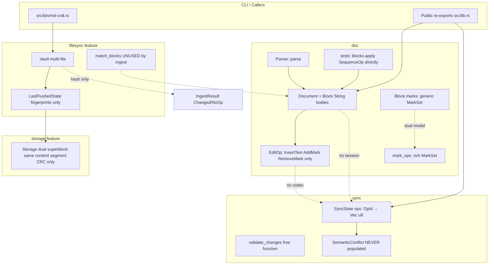
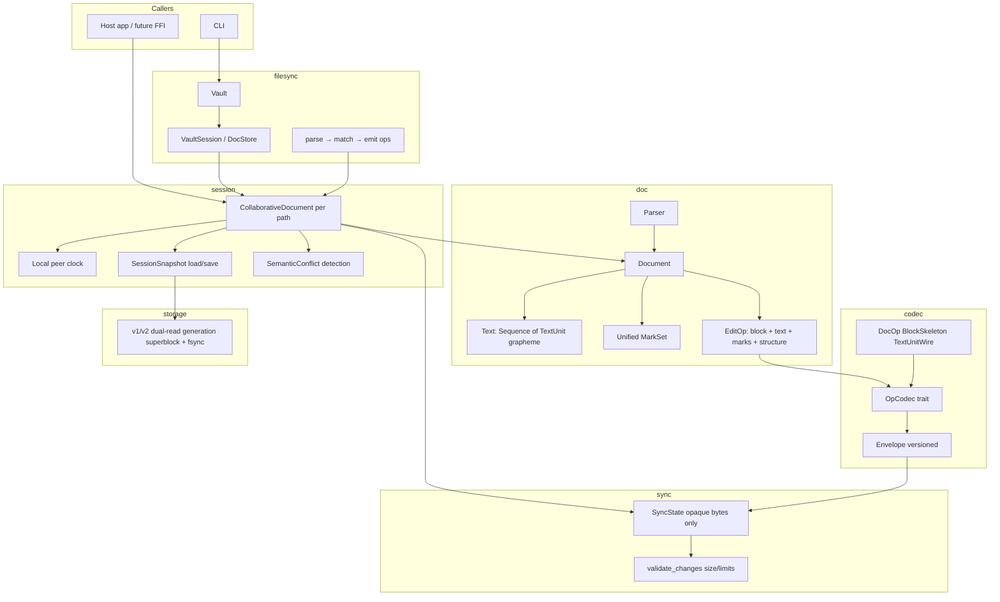
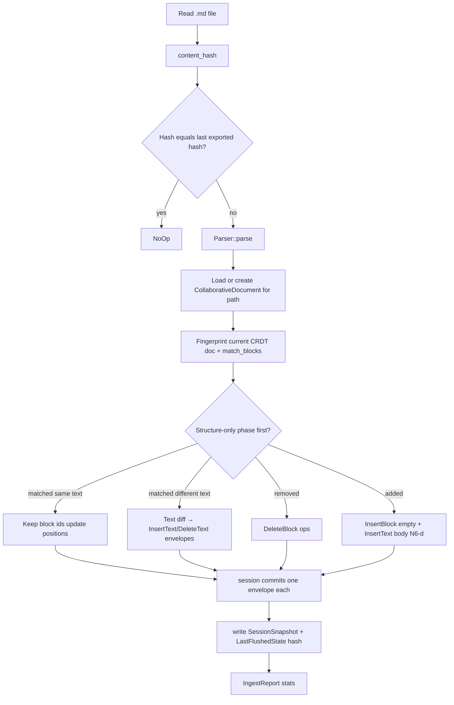
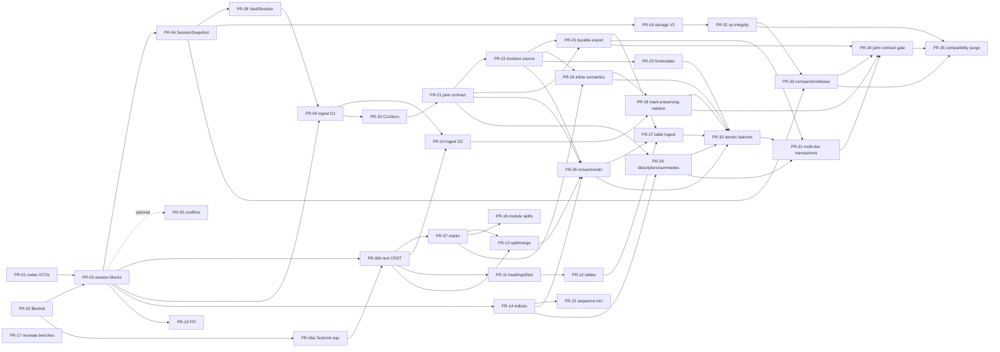

# Architecture Evolution Design for md-crdt

| Field | Value |
| --- | --- |
| **Document title** | Architecture Evolution Design for md-crdt |
| **Author** | Travis Silvers |
| **Date** | 2026-07-09 |
| **Status** | Draft (revision 11 — Phase K agent-efficient workspace operations complete) |
| **Repository** | `/Users/firestrand/Projects/latenty-infinity/md-crdt` |
| **Current version** | `0.1.0` (pre-1.0; breaking changes allowed with changelog discipline) |
| **License** | MIT |
| **Rust** | Edition 2024, `rust-version = "1.85"` |

### Revision history (challenge log)

| Rev | What changed | Challenge / value |
| --- | --- | --- |
| **1–4** | Integration spine, N1–N5 clocks, SessionSnapshot, multi-doc vault, V1/V2 storage | Establishes end-to-end collab; **kept** — without this the review’s gaps stay unsolved |
| **5** | Run-length `TextRun` in Phase B; N6 range-seed default; Unicode pin; N4 carve-out | Ambitious scale/wire compactness; **partially reversed in rev 6** — complexity vs value failed KISS for MVP |
| **6** | Critical re-challenge of every major choice; see [Critical challenge of design choices](#critical-challenge-of-design-choices) | Default to **per-grapheme text + InsertBlock/InsertText pair (N6-d)**; demote run-length and range-seed; fix mark `render_spans` assumption; slim MVP |
| **6 (review)** | Gap-fixes on the two-op path: `DeleteText` gains its delete-op `id`; `insert_block` empties paragraph text; N2 covers all delete ids | Closes correctness holes the (d) reversal newly exposed |
| **6 (wire)** | Collab producers **MUST** send `Paragraph { text: "" }` on `InsertBlock`; codec/session **reject** non-empty (no ignored dead payload) | Trades leniency for a wire that cannot carry misleading bytes; Phase A still allows full string bodies |
| **6 (consistency)** | N1 multi-envelope convenience APIs; A→B wire dual-read for non-empty skeletons; vault ingest N6-d; layout/`apply_remote` cleanup | Closes contradictions found in full-doc review |
| **6 (review)** | Empty-paragraph rejection moved from `CodecError` → `SessionError` (codec stays pluggable per Decision D); codec keeps only a pure predicate | Layering fix — semantic rule lives at the layer that owns `unit_mode`, not in per-codec error types |
| **7** | Added native move/reorder, parsed-table ingest, mark-preserving external replacement, safe V1 segment cleanup, and an adapter-facing efficiency phase for `md-mcp` | Closes known product gaps and lets agents locate, edit, and verify bounded Markdown regions without full-document serialization or rediscovery |
| **8** | Rewrote all unfinished work after Phase H as a coordinated four-phase joint-release roadmap; added honest lossless editing, stable workspace identity, semantic inline/frontmatter/link support, durable Markdown export, multi-document operations, and long-running compaction | The live `md-mcp` service duplicates the Markdown engine and both projects overclaim exact serialization after mutation; correctness and source fidelity must precede protocol optimization |
| **9** | Removed legacy snapshot/storage compatibility from the release contract and added a final breaking cleanup slice | The two projects ship together before 1.0; retaining V1/V2 snapshot readers and V1 storage migration paths adds code, fixtures, and ambiguity without user value |
| **10** | Completed authoritative inline/frontmatter semantics, native moves, parsed table ingest, and mark-preserving external replacement | Closes the semantic Markdown gaps before Phase K freezes bounded agent-facing mutation and summary primitives |
| **11** | Completed bounded descriptors/change receipts, preconditioned semantic edit batches, file lifecycle operations, and recoverable multi-file export | Gives `md-mcp` a stable, compact core contract for discovery, mutation, invalidation, and durable publication without normal-path full-document serialization |

**Compatibility policy (supersedes earlier migration notes):** completed sections below retain
historical implementation details, but they are not release requirements. The joint release accepts
only the current V3 session snapshot and current V2 dual-slot storage format. PR-35 removes V1/V2
session-snapshot readers and V1 storage readers/fixtures; older vault state must be reinitialized and
re-ingested from Markdown.

---

### Critical challenge of design choices

Each major recommendation was re-checked for **correctness, SOLID/DRY/KISS, and Rust practicality**. Outcomes:

| Choice | Verdict | Why |
| --- | --- | --- |
| **A. Session + codec + opaque sync** | **Keep** | Highest leverage; only way layers connect without polluting `sync` with markdown |
| **B. Phase A includes InsertBlock/DeleteBlock** | **Keep** | Tests already need block RGA; deferring forces fake E2E |
| **C. N1 max-OpId envelope / N3 encode-before-apply / N4 wire `right_origin`** | **Keep** | Required for causal SV + RGA concurrency; no cheaper correct alternative |
| **D. JSON ops + rkyv storage dual stack** | **Keep for 0.1** | Debuggability > wire size; compact codec is open extension, not default debt |
| **E. Deterministic BlockId (`from_u128`)** | **Keep** | v4 destroys identity for vault/tests; tiny change, high value |
| **F. SessionSnapshot + multi-file VaultSession** | **Keep** | Vault is multi-file today; fingerprint-only state is not collab |
| **G. Storage generation dual-superblock** | **Keep (post-MVP)** | Matches claimed crash-safety; not needed to prove collab |
| **H. Mark unification after text anchors** | **Keep** | Dual API is pure debt; order after B is correct |
| **I. N6 (c) InsertBlock range-seed (`G` on receive)** | **Reject as default** | Cross-peer Unicode agreement is a real interop landmine for little gain vs **(d)** empty InsertBlock + `InsertText` with explicit unit ids. (c) adds N4 carve-out, fail-closed G-mismatch, exact crate pins — cost > value for 0.1 |
| **J. Run-length `TextRun` from Phase B** | **Reject for MVP; defer to F** | Claim that “retrofit is breaking” is **overstated**: grapheme OpIds can stay the identity even if storage later coalesces into runs. Run-split + mark index + RGA-on-runs multiplies Phase B risk. Existing `Sequence` tests apply 1:1 to **per-grapheme** elements. Wire still batches paste via N1. Scale when profiled. |
| **K. SemanticConflict as MVP gate (PR-05)** | **Demote** | Observational only; convergence does not depend on it. Ship after MVP or optional |
| **L. `import_state` separate from restore+rebind** | **Keep thin wrappers** | Documented as composeable; fine for clarity, not a second subsystem |
| **M. MVP = wire + text CRDT + marks** | **Keep shape; adjust contents** | MVP = PR-01–04 + PR-06a/06b + PR-07. PR-05 optional. No run-length, no N6-(c) |

**Net value of revision 6:** same end-state architecture, **less speculative complexity on the critical path**, fewer ways for peers to disagree silently, and mark/text models that match `render_spans` today (`element_order` is one OpId per visible grapheme unit).

---

## Overview

md-crdt is a Rust library + CLI for offline-first, deterministic collaboration on Markdown. It already has strong CRDT building blocks (`Sequence` RGA, `LwwRegister`, `Map`, dual mark systems), a block-level document model with parse/serialize, an opaque-byte sync protocol, dual-superblock storage, and vault fingerprinting. What it lacks is an **integrated collaborative stack**: document edits do not encode onto the wire, in-paragraph text is a plain `String` (not a CRDT), marks are duplicated, vault ingest only hash-compares, and several durability claims are weaker than the API surface implies.

This design proposes a phased architecture evolution that wires existing layers into a correct end-to-end collaborative system, then deepens text/mark fidelity, vault intelligence, structured markdown, performance, storage durability, and developer experience—while obeying **SOLID**, **DRY**, **KISS**, and the project's [Rust Code Standards](.docs/Rust%20Code%20Standards.md) (borrow-first APIs, typed `thiserror` enums, feature gates, profiling-driven perf, no panics in library paths).

**MVP definition:** Phases A–C (wire + session + **per-grapheme** text CRDT + unified marks) form a shippable collaborative library vertical slice. Phases D–E add product/vault/structure. Phases F–H polish durability, **run-length text storage if profiled**, and DX. See [Sequencing & MVP](#sequencing--mvp).

---

## Background & Motivation

### Current workspace layout

| Component | Role | State |
| --- | --- | --- |
| `md-crdt` (root crate) | Library modules `core`, `doc`, `sync`; optional `storage`, `filesync`; binary `src/bin/md-crdt.rs` | Primary product surface |
| `md-crdt-ffi` | Reserved FFI workspace member | Unpublished (`publish = false`); no C ABI or supported bindings |
| `md-crdt-naive-oracle` | Differential testing oracle | Used by integration tests |
| `md-crdt-ci` | CI helper | Minimal / smoke only |

**Module sizes (approx.):**

| Path | LOC | Responsibility |
| --- | --- | --- |
| `src/core/mod.rs` | ~544 | `OpId`, `StateVector`, `Sequence` RGA, `LwwRegister`, `Map`, generic `MarkInterval`/`MarkSet`/`TextAnchor` |
| `src/core/mark.rs` | ~210 | Rich `MarkKind`, `Anchor`, causal remove-wins `MarkSet`, span rendering |
| `src/doc/mod.rs` | ~1159 | `Document`, `Block`, `BlockKind`, `Parser`, serialize, `EditOp`, `insert_text`, tables |
| `src/doc/mark_ops.rs` | ~149 | Rich-mark expand/split helpers |
| `src/sync/mod.rs` | ~793 | Opaque `Operation { id, payload: Vec<u8> }`, `SyncState`, validation, `ApplyResult` |
| `src/storage/mod.rs` | ~492 | Dual superblock snapshot, segment CRC only, bare op segments, compact |
| `src/filesync/mod.rs` | ~728 | `Vault`, fingerprinting, `match_blocks` (unused by ingest path) |
| `src/bin/md-crdt.rs` | ~204 | CLI: status / init / flush / ingest / sync |
| `src/lib.rs` | ~85 | Re-exports; dual mark naming (`MarkSet` vs `RichMarkSet`) |

Benchmarks in root `Cargo.toml` are commented out (`"will be migrated separately"`). There is **no** `benches/` directory in the source tree today—only historical Criterion artifacts under `target/criterion/`. Benches must be recreated (from git history if available, or rewritten).

### What works today

1. **Block-level RGA** — `Document.blocks: Sequence<Block>` converges under concurrent block inserts/deletes (validated by `tests/doc_merge_behavior.rs`, `tests/doc_determinism.rs`, core RGA property/differential tests). Today concurrent block tests call `Document.blocks.apply(SequenceOp::…)` directly—not via `EditOp`.
2. **Sync plumbing** — `SyncState` tracks ops by `OpId`, encodes deltas via `StateVector`, buffers out-of-order peer ops. `validate_changes` exists as a **separate** free function (used by fuzz/tests); `apply_changes` does **not** call it and never fills `SemanticConflict`.
3. **Storage skeleton** — dual superblock **files** with **identical** content; **CRC32 protects segment payload bytes only** (`crc32fast` in `write_snapshot` / `read_snapshot`). Superblock metadata itself has **no** self-CRC. Op segment files (`append_op_segment`) are bare `fs::write` with **no** checksum. Compaction + tombstone retention exist.
4. **Vault skeleton** — walks many `.md` files; per-file state under `.mdcrdt/state/…/*.mdcrdt`; flush stores `LastFlushedState` (content hash + block fingerprints) **not** a full CRDT document/op log; ingest only compares `content_hash`; `match_blocks` implements fuzzy bipartite matching but is unused on the ingest path.
5. **Quality bar** — proptest, differential oracle, libfuzzer targets (`parser`, `apply_changes`, `decode_changes`, `merge_convergence`), CommonMark + external fixtures.

### Pain points (architectural gaps)

1. **Layers not wired** — `EditOp` never becomes `Operation.payload`. No codec. No type that owns `Document` + `SyncState` + peer clock. Storage/Vault operate on fingerprint snapshots unrelated to sync ops.
2. **Text is not a CRDT** — `BlockKind::Paragraph { text: String }`; `insert_text` does `String::insert_str` after cloning the whole `Block` and `update_value`. Concurrent in-paragraph edits diverge.
3. **Dual mark systems** — Generic LWW `core::MarkSet<K,V>` on `Block.marks` / `EditOp`; rich causal `core::mark::MarkSet` in `mark_ops` / `RichMarkSet` re-export.
4. **Vault multi-file vs single-doc gap** — `Vault` is multi-file; any session API must be multi-document (or a store of sessions), not one global `CollaborativeDocument`.
5. **`SemanticConflict` dead API** — never populated; concurrent-insert detection requires sequence semantics that opaque `sync` must not own.
6. **Non-deterministic block IDs** — `Uuid::new_v4()` in `Block::new`, table rows, `AddedBlock.id`.
7. **Storage crash safety weaker than claims** — same-content dual write, no generation, no fsync; module docs advertise “crash-safe.”
8. **Incomplete edit surface** — no `DeleteText` / block split-merge as EditOps; no `InsertBlock`/`DeleteBlock` on the collaborative API (only direct `Sequence` apply in tests); tables not parsed; headings/lists unstructured.
9. **Performance** — `rebuild_order` rebuilds parent→child maps, sorts **every sibling group**, and tree-walks on each insert that rebuilds (cost is **≥ O(n log n)** in typical cases; pathological concurrent sibling fans + pending replay are worse). `insert_text` O(n) BlockId scan; `state_vector` scans all ops; nested text CRDT will reintroduce per-unit rebuild cost until optimized.
10. **Product incompleteness** — FFI placeholder; no source `benches/`; large monofiles; CLI hash-only dirty detection.

### Why change now

Without an integration spine and character-level CRDT, multi-peer collaboration is correct only at block granularity, and only when callers manually apply `SequenceOp`s. Expanding vault intelligence or structured markdown on string-splice paragraphs would cement a broken convergence model. Order: **wire + session + block ops first**, then **text CRDT**, then **unify marks**, then **vault/structure**, then **perf and durability polish**.

---

## Goals & Non-Goals

### Goals

1. End-to-end multi-peer collaboration: local edit → encode → exchange → decode → apply → converge (blocks **and**, after Phase B, in-paragraph text).
2. Per-grapheme CRDT for paragraph text (code/cells later; optional run-length in F).
3. Single mark model with causal remove semantics and element anchors.
4. Multi-file vault with per-path sessions; ingest that emits CRDT ops via `match_blocks`.
5. Versioned session snapshots + crash-safe storage protocol.
6. Incremental, independently reviewable PRs; tests remain green or deliberately migrated.
7. Module boundaries matching SOLID / DRY / KISS; Rust standards compliance (typed errors, borrow-first, profile-driven perf).
8. Pre-1.0 API cleanup with changelog discipline.
9. A narrow adapter contract for `md-mcp`: stable block identity across refresh, lightweight structure discovery, bounded change receipts, and atomic targeted edits that avoid full-file rereads.
10. Lossless local Markdown editing: unchanged source bytes survive scoped mutations, while semantic CRDT state continues to converge.
11. A stateful vault/workspace API that owns ingest, durable Markdown export, stable document identity, revisions, and multi-document mutation boundaries.

### Non-Goals

1. Multi-tenant cloud, auth servers, hosted realtime backends.
2. Full CommonMark AST parity (headings/lists/tables in scope; HTML/entity edge cases best-effort).
3. Network transport — design stops at codec + session; host supplies transport.
4. Premature micro-crates or plugin frameworks.
5. Yjs/Automerge interop (future, not this evolution).
6. Zero public API breaks at 0.1.0 — breaks allowed when changelog-documented.
7. Authenticated or encrypted peer channels (see trust model).
8. MCP tool schemas, response pagination, search ranking, or token counting; those remain `md-mcp` responsibilities.

### Sequencing & MVP

| Horizon | Phases | Outcome | Rough effort |
| --- | --- | --- | --- |
| **MVP collab** | A (+ A′ snapshot), B, C | Library can multi-peer edit blocks + text + marks over `ChangeMessage` | Multi-week |
| **Product surface** | D, E | Vault true ingest + structured markdown | Multi-week |
| **Polish** | F, G, H | Perf (incl. optional run-length), durable storage, benches/FFI/CLI | Multi-week |
| **Joint foundation** | I | Stable workspace contract, lossless source model, durable Markdown export | Three focused PRs; unlocks parallel `md-mcp` work |
| **Semantic completeness** | J | Inline marks/links, frontmatter, section move, table ingest, mark-preserving replacement | Five focused PRs |
| **Agent workspace** | K | Bounded descriptors/deltas, atomic batches, file lifecycle, multi-document transactions | Three focused PRs plus downstream integration |
| **Long-running hardening** | L | Op integrity, compaction/rebase, joint contract fixtures, final compatibility purge | Four focused PRs |

**MVP release gate = PR-01–PR-04 + PR-06a/06b + PR-07** (Phases A, A′, B, C). SessionSnapshot (PR-04), per-grapheme text CRDT (PR-06a/06b), and mark unification (PR-07) are required. **PR-05 (SemanticConflict observation) is optional** — not a release gate. **PR-06b alone is not a release gate.** Vault, structure, Sequence rewrite, run-length storage, fsync protocol, and FFI (PR-08+) are not required for MVP collab.

---

## Current vs Target Architecture

### Current architecture (layers disconnected)



### Target architecture (integrated spine)



### SOLID / DRY / KISS → module boundaries

| Principle | Mapping |
| --- | --- |
| **S**ingle responsibility | `core` = pure CRDT primitives; `doc` = markdown model + local edit apply; `codec` = wire DTOs encode/decode only; `sync` = causal op log + size limits (**no** markdown, **no** SemanticConflict population); `session` = Document+SyncState+clock+decode/apply+conflict observation+snapshot; `storage` = durable container for opaque payloads; `filesync` = multi-file vault + matching → session ops |
| **O**pen/closed | `OpCodec` + versioned `Envelope`; strict current-format V2 storage after PR-35 |
| **L**iskov | Codecs round-trip the same op set; fail closed on unknown versions; never silently drop ops |
| **I**nterface segregation | Feature gates; parse-only callers need not pull filesync; sync free of doc types |
| **D**ependency inversion | Session depends on `OpCodec` trait; storage stores caller bytes |
| **DRY** | One mark model; one wire DTO family; one identity strategy; one clock rule |
| **KISS** | Thin session façade; no mega-framework; MVP before vault intelligence; opaque sync stays simple |

Recommended layout:

```
src/
  core/           # Sequence, OpId, StateVector, Lww, Map, unified mark
  doc/            # Document, Block, Parser, serialize, EditOp, text units
  codec/          # Envelope, OpCodec, wire DTOs (DocOp, BlockSkeleton, TextUnitWire)
  sync/           # SyncState, validate_changes, ApplyResult (opaque; conflicts observed in session)
  session/        # CollaborativeDocument, SessionSnapshot, optional conflict detection
  storage/        # feature: durable container (generation protocol)
  filesync/       # feature: Vault, VaultSession/DocStore, match_blocks → ops
  bin/md-crdt.rs
```

---

## Proposed Design

### Phase order and rationale

| Phase | Name | Why this order |
| --- | --- | --- |
| **A** | Integration spine | Wire + session + **block** ops + snapshot schema; E2E multi-peer for blocks |
| **B** | Per-grapheme text CRDT | Convergence for in-paragraph edits; reuse `Sequence` 1:1; nested apply |
| **C** | Mark unification | DRY after text element anchors exist |
| **D** | Vault true ingest + multi-doc store | Needs codec + session persistence + text/structure ops |
| **E** | Structured markdown | Expand surface on correct base |
| **F** | Sequence performance + indices (+ optional run-length) | Profile-driven after correctness |
| **G** | Storage durability protocol | Container hardening; payload already defined in A′ |
| **H** | DX | Benches (recreate), FFI, module splits, CLI |
| **I** | Joint contract + lossless foundation | Give `md-mcp` stable types early; make exact editing and Markdown export honest before cutover |
| **J** | Semantic completeness | Close inline/frontmatter/move/table/mark fidelity gaps on the lossless source model |
| **K** | Agent-efficient workspace | Expose bounded deltas and atomic document/vault mutations without MCP policy in core |
| **L** | Long-running hardening | Bound storage growth, finish integrity cleanup, and freeze joint consumer contracts |

Phase G can parallelize with B/C once A′ defines snapshot **payload** bytes. Do **not** expand vault op emission before A + A′. Phases I–L begin after the completed Phase H baseline. `md-mcp` may implement protocol/retrieval work against contract fixtures once PR-21 lands, but it must not cut over from its legacy service until PR-23 makes the workspace persistence path honest.

---

### Normative rules (cross-cutting)

These rules are binding for all phases.

#### N1 — Operation clock rule (one Envelope ↔ one Operation)

1. **Wire unit of causality:** each `sync::Operation` carries **exactly one** `Envelope`. `StateVector` / causal readiness track **operation** ids only.
2. An envelope may embed **multiple** element `OpId`s (e.g. paste of N graphemes as nested RGA inserts in one `InsertText`).
3. `Operation.id` is the **maximum** `OpId` (by `(counter, peer)` total order) among all ids **allocated in that envelope**, including nested unit/block element ids that share the local peer. (`DeleteText` allocates only the delete-op `id`; `Operation.id` is that id.)
4. Session `next_counter` advances to `Operation.id.counter + 1` after each successful local commit (so the next alloc is strictly greater than every id in the last envelope).
5. Nested element ids are **payload-internal** (not separate `Operation`s).
6. Remote apply: after decoding, apply all nested RGA effects from the envelope (including explicit `InsertText` unit lists); do not invent extra `Operation`s per grapheme.
7. **Paste vs keystroke:** keystroke → typically one unit, one op; paste → one op with `units: Vec<…>` (batched). Vault LCS may emit one or few envelopes per region (see Phase D).
8. **Convenience APIs may emit multiple Operations:** a single user gesture (e.g. `insert_paragraph`, vault “add block with body”) may perform **two (or more) successive N3 commits**, each its own Envelope/Operation. Undo/UX may group them; the wire and SV always see separate ops. This does **not** violate N1 — N1 constrains **each** commit, not each UX gesture.
9. **Block with initial text (Phase B+):** use **two** local commits (N6-d): `InsertBlock` (empty paragraph skeleton) then `InsertText` (explicit unit ids). Do **not** imply text unit ids from skeleton string grapheme count.

#### N2 — Who assigns OpIds

- Session allocates ids **only inside N3 commit** from `next_counter` (private to the commit). Public surface is `peek_next_id()` for diagnostics — **no** advancing public `alloc_id()`.
- High-level APIs (`insert_text`, `insert_block`) take content + anchors only; the session computes the contiguous counter range for that commit.
- Remote envelopes: trust peer’s ids (trust model); reject if `Operation.id` ≠ max id implied by the envelope (`InsertText` → max unit id; `InsertBlock` → block elem id; `DeleteBlock` / `DeleteText` → the delete-op `id`); reject peer field mismatches.

#### N3 — Encode-before-apply (local)

**Normative (matches Key Decision 16 only — no dual clock-burn semantics):**

1. Validate the intended edit against the current document (anchors exist or are acceptable for RGA buffering). On failure → `Err`, **no** id allocation, **no** clock advance.
2. Allocate ids **inside** this commit from `next_counter` (do not pre-allocate in a separate public `alloc_id` that advances state). Document is still **not** mutated.
3. Build `Envelope` with those ids.
4. `codec.encode`. On failure → discard allocated ids (they were never published); **do not** advance `next_counter`; return `Err`.
5. Apply envelope to `Document` (transactional per envelope: all nested effects or none—validate-first so apply is effectively total for well-formed envelopes; otherwise apply-to-temp then swap). On failure → **do not** `add_local_op`; **do not** advance clock; return `Err` with document unchanged.
6. `sync.add_local_op(Operation { id: max_id, payload })`.
7. Set `next_counter = max_id.counter + 1`.

Ids are never “burned” on failed encode/apply. Only a successful step 6 advances the peer clock.

#### N4 — right_origin on wire

Every RGA **insert** (block or text unit) that appears **on the wire** **must** carry `right_origin: Option<OpId>` as computed by the producing peer’s `Sequence::compute_right_origin` equivalent at insert time. Receivers **must** apply the wire `right_origin`, not recompute from local order (matches existing RGA concurrency tests in `tests/core_rga_*.rs`).

**No carve-outs.** Revision 5 introduced an exception for InsertBlock range-seeding; revision 6 **removes** that path. Skeleton strings never imply text unit ids, so every text unit travels (or is omitted) as an explicit `InsertText` with wire `right_origin`.

#### N5 — Trust model

Sync messages and vault files are **trusted peer / trusted local disk**. There is no authentication, encryption, or Byzantine tolerance. Limits (`ValidationLimits`) and decode caps exist only for resource safety against buggy or hostile **local** inputs (fuzz, malformed files), not for adversarial multi-tenant security.

#### N6 — Block body text seeding (Phase B+): **two-op path (d) is default**

**Problem.** New paragraphs often carry initial text (parse, vault ingest, `insert_block(Paragraph { text })`). Text units need OpIds. Options:

| Option | Mechanism | Verdict (rev 6) |
| --- | --- | --- |
| (a) Expand only locally; put full unit OpIds on InsertBlock wire | Large skeleton | Rejected — couples structure wire to full text payload |
| (b) Separate id space from parent block id | Dual clocks | Rejected — collides with peer SV mental model |
| (c) Range-seed: receivers recompute `G` graphemes from skeleton string; unit ids = `b+1..b+G` | Compact InsertBlock | **Rejected as default** — forces cross-peer Unicode agreement, N4 carve-out, fail-closed on segmenter skew (rev 5 cost) |
| **(d) Structure-only InsertBlock + separate InsertText** | Two envelopes; explicit unit ids on wire | **Accepted default** — pure N1–N4; no `G` agreement; one extra op |

**Default algorithm (local “insert paragraph with text” convenience API):**

1. **Commit 1 — `InsertBlock`:** skeleton is always `Paragraph { text: "" }` on the collab path (Phase B+). Content goes only in step 2. `Operation.id == block elem_id`. One counter.
2. **Commit 2 — `InsertText`:** grapheme-split content; allocate unit ids; each unit carries `after` / `right_origin` on wire (N4); `Operation.id` = max unit id (N1).

Vault ingest and “create block with body” helpers **must** emit this pair (or a single `InsertText` into an existing empty block), never invent receiver-side `G`.

#### N6 empty-paragraph wire rule (Phase B+ collab — normative)

| Role | Rule |
| --- | --- |
| **Collab producers (unit-mode session)** | **MUST** send `BlockKindSkeleton::Paragraph { text: "" }` on every `InsertBlock`. Session helpers force this when building the envelope — never copy a non-empty local string into the skeleton. |
| **Session decode / pre-decode (unit-mode)** | **MUST reject** `InsertBlock` whose paragraph skeleton has `!text.is_empty()` with `SessionError::NonEmptyParagraphOnInsertBlock` (pre-decode fail-closed for the whole message). Do **not** ignore dead payload. The check runs at the **session** layer (which knows document mode) over the decoded, codec-agnostic `Envelope` — not as an unconditional codec-level reject of all historical envelopes. |
| **Materialize (unit-mode)** | On accept, always create an **empty** `Sequence<TextUnit>` for the paragraph; units arrive only via subsequent `InsertText`. |
| **Phase A (string-mode session)** | Full string body in the skeleton is **valid** and **is** the paragraph body. Empty-paragraph assertion is **off**. |
| **Non-paragraph kinds** | `CodeFence` / `RawBlock` keep their string body on the wire (not unit CRDTs in Phase B). |

**A→B wire migration (must not break mixed history):**

| Situation | Behavior |
| --- | --- |
| All peers still string-mode (Phase A) | Non-empty `Paragraph.text` on `InsertBlock` is the body; multi-peer block collab works for structure + string content. |
| Peer upgrades to unit-mode (Phase B) | **Live exchange:** only unit-mode ops (empty InsertBlock + InsertText). Peers should upgrade together before relying on text CRDT collab. |
| Offline snapshot upgrade string → units | Expand paragraph strings into `Sequence<TextUnit>` with peer-0 synthetic ids from the **one** per-doc counter (not by replaying non-empty InsertBlock as if it were N6-c). |
| Unit-mode peer receives non-empty InsertBlock | **Reject** (fail closed). Do not silently strip. Repair path: peer resync from a unit-mode snapshot, not partial ignore. |

**Why fail closed instead of “ignore non-empty” (unit-mode):**

- Ignored bytes invite producers that “work” locally while peers drop content, and tools that dump envelopes show misleading text.
- Asserting empty costs almost nothing and makes the two-op contract visible on the wire.
- Debug/import that needs human-readable structure uses snapshots, parse paths, or Phase A string-mode bodies — not unit-mode `InsertBlock` dead fields.

**Why (d) wins on KISS/value:**

- No Unicode version pin for **op identity** (segmenter still used locally for offsets and for **producer-side** unit lists, but receivers trust the list).
- N4 stays universal — no special seed path.
- Second op is cheap relative to debugging divergent `G`.
- Matches how paste already works (explicit units).
- Wire for structure inserts cannot smuggle ignored paragraph text.

**Optional later optimization (not MVP):** reintroduce range-seed (c) behind a feature flag **only if** profiling shows bulk `InsertBlock`+`InsertText` pairs dominate and all peers pin the same `unicode-segmentation` exact version. Document as experimental; default stays (d).

**Phase A:** paragraphs are still `String`; `InsertBlock` is structure+string body with no unit ids; `Operation.id == block id`. Phase B migrates storage to `Sequence<TextUnit>` and requires the two-op path plus the empty-paragraph wire rule.

**Synthetic-id offline path (collision rule):** snapshot v1 offline upgrade and parser single-peer seed both use `peer = 0` and **must** draw from **one** per-document monotonic counter for block `elem_id`s and text unit ids — never restart counters per paragraph. This offline path is for parse/import only, not for live multi-peer apply of implied skeleton ranges.

---

### Phase A — Integration spine (block ops + session + wire)

#### Problem

- `EditOp` is only `InsertText | AddMark | RemoveMark` (`src/doc/mod.rs`); block inserts in tests use `Document.blocks.apply(SequenceOp)`.
- No codec; no session; no snapshot schema.

#### Wire DTOs (not runtime Sequence state)

**Forbid** serializing live `Sequence` internals (`elements`, `index`, `pending_*`).

```rust
// src/codec/wire.rs

pub const WIRE_VERSION: u16 = 1;

#[derive(Debug, Clone, PartialEq, Eq, Serialize, Deserialize)]
pub struct Envelope {
    pub version: u16,
    pub body: OpBody,
}

#[derive(Debug, Clone, PartialEq, Eq, Serialize, Deserialize)]
pub enum OpBody {
    /// One logical op; may expand to multiple nested RGA effects.
    Doc(DocOp),
}

#[derive(Debug, Clone, PartialEq, Eq, Serialize, Deserialize)]
pub enum DocOp {
    /// Block-level RGA insert with skeleton only (no nested live Sequence).
    InsertBlock {
        after: Option<OpId>,
        id: OpId,                    // block elem_id
        right_origin: Option<OpId>,
        block: BlockSkeleton,
    },
    DeleteBlock {
        target: OpId,                // block elem_id
        id: OpId,                    // delete-op id (also Operation.id if sole effect)
    },
    /// Phase B+
    InsertText { /* see Phase B */ },
    DeleteText { /* see Phase B */ },
    /// Phase C+
    SetMark { /* … */ },
    RemoveMark { /* … */ },
    /// Phase E+
    // SplitBlock, MergeBlocks, …
}

/// Serializable block creation payload — no Sequence maps.
#[derive(Debug, Clone, PartialEq, Eq, Serialize, Deserialize)]
pub struct BlockSkeleton {
    pub block_id: BlockId,
    pub kind: BlockKindSkeleton,
    // marks empty at insert; mark ops are separate envelopes (or optional initial empty)
}

#[derive(Debug, Clone, PartialEq, Eq, Serialize, Deserialize)]
pub enum BlockKindSkeleton {
    /// **Stable JSON shape across Phase A and B (Key Decision 21):** `{ text: String }`.
    /// Phase A: `text` **is** the paragraph body.
    /// Phase B+ collab: `text` **MUST** be `""` (unit-mode **session** rejects otherwise;
    /// the codec stays mode-agnostic — see N6 empty-paragraph wire rule).
    /// Units arrive only via `InsertText` (N6-d). Non-empty is not “debug leniency.”
    Paragraph { text: String },
    CodeFence { info: Option<String>, text: String },
    BlockQuote {
        /// Nested blocks as skeletons only (finite depth; encode + decode enforce max depth).
        children: Vec<BlockSkeletonInsert>,
    },
    RawBlock { raw: String },
    // Table variant is deferred to the table PR (Phase E / PR-12); PR-01 ships the four
    // kinds above (rows will likely be separate ops rather than a nested skeleton).
}

#[derive(Debug, Clone, PartialEq, Eq, Serialize, Deserialize)]
pub struct BlockSkeletonInsert {
    pub after: Option<OpId>,
    pub id: OpId,
    pub right_origin: Option<OpId>,
    pub block: BlockSkeleton,
}

/// Max nested BlockQuote / structure depth on decode (security + stack).
pub const MAX_WIRE_NEST_DEPTH: u32 = 16;
```

**Note:** For Phase A MVP, prefer **flat** documents in collab tests (no nested quote children on wire) to keep PR-01 small; `BlockQuote` children vector is allowed but depth-capped.

```rust
pub trait OpCodec {
    type Error: std::error::Error + Send + Sync + 'static;

    fn encode(&self, envelope: &Envelope) -> Result<Vec<u8>, Self::Error>;
    fn decode(&self, bytes: &[u8]) -> Result<Envelope, Self::Error>;
}

#[derive(Debug, Default, Clone, Copy)]
pub struct JsonOpCodec;

#[derive(Debug, thiserror::Error)]
pub enum CodecError {
    #[error("serde: {0}")]
    Serde(String),
    #[error("unknown wire version {0}")]
    UnknownVersion(u16),
    #[error("nest depth exceeded")]
    NestDepthExceeded,
    #[error("invalid envelope: {0}")]
    Invalid(&'static str),
}
```

**Where empty-paragraph is enforced:** at the **session** layer (`check_insert_block_paragraph_empty` / encode helpers), only when the session is in **unit-mode** (after Phase B cutover), inspecting the decoded `Envelope`. The codec stays mode-agnostic and **never** unconditionally rejects non-empty paragraphs on decode (Phase A / historical payloads are valid). A pure predicate (`wire::insert_block_paragraph_is_empty(&Envelope) -> bool`) may live in `codec` for reuse, but the error is `SessionError::NonEmptyParagraphOnInsertBlock` — per-codec `Error` types stay free of this semantic rule so alternate codecs (Decision D) need not know it. See N6 A→B migration table.

**Default wire format (decision):** `JsonOpCodec` is the **default for 0.1** (debug, fuzz corpus readability). Storage snapshots continue to use **rkyv** (already in tree). This is an intentional dual stack: human-inspectable ops vs compact durable snapshots. Expected size: ~50–200+ bytes JSON per keystroke unit envelope; paste of 1k graphemes may be tens of KB JSON—acceptable for 0.1; if profiling shows CPU/size pain, add `PostcardOpCodec` or `BincodeOpCodec` behind feature without changing `Envelope` semantics. JSON remains available for tests/debug even if default later switches.

#### EditOp / session API for blocks (Phase A)

Extend collaborative surface (can live as `DocOp` applied by session without requiring all variants on legacy `EditOp` enum immediately—but public `EditOp` should grow to match for DRY):

```rust
// Align EditOp with DocOp for local construction; session converts EditOp → Envelope.
pub enum EditOp {
    InsertBlock {
        after: Option<OpId>,
        block_id: BlockId,
        kind: BlockKind, // local; converted to skeleton (string paragraph in Phase A)
        // id / right_origin assigned by session
    },
    DeleteBlock { target: OpId },
    InsertText { /* existing / Phase B */ },
    // …
}
```

Session methods (normative):

```rust
impl<C: OpCodec> CollaborativeDocument<C> {
    /// Returns block `elem_id`. Always equals this envelope’s `Operation.id`
    /// (single-effect InsertBlock — N6-d never folds text into this op).
    pub fn insert_block(
        &mut self,
        after: Option<OpId>,
        kind: BlockKind,
    ) -> Result<OpId, SessionError>;

    /// Phase B+ convenience: InsertBlock (empty/structure) then InsertText for body.
    /// Two commits, two Operation ids. Returns block `elem_id`.
    pub fn insert_paragraph(
        &mut self,
        after: Option<OpId>,
        text: &str,
    ) -> Result<OpId, SessionError>;

    /// Returns the delete-op id (== Operation.id for this single-effect envelope).
    pub fn delete_block(&mut self, target: OpId) -> Result<OpId, SessionError>;
}
```

Algorithm `insert_block` (follows **N3**; no public `alloc_id`; **no** text-unit seeding):

1. **Validate** `after` against current block sequence (or accept RGA-bufferable missing anchor). On failure → `Err`, no clock change.
2. Build `BlockKindSkeleton` from `kind`:
   - **Phase B+ collab:** if kind is paragraph, **force** `Paragraph { text: "" }` (strip any local body). Body content is never placed on this envelope.
   - **Phase A:** may put the full string in the skeleton (string body model).
3. **Allocate inside commit:** `b = self.next_counter`; `block_elem = OpId { peer: self.peer, counter: b }`; `block_id = block_id_from_op(block_elem)`. Do **not** advance `next_counter` yet.
4. `right_origin = document.blocks.compute_right_origin(after)` (public thin wrapper around today’s private helper).
5. Build `Envelope { version: 1, body: Doc(InsertBlock { after, id: block_elem, right_origin, block: skeleton }) }`.
6. `codec.encode` → on failure discard reservation, return `Err`. (Unit-mode: session has already forced empty paragraph text before encode.)
7. Apply: insert `Block { id: block_id, elem_id: block_elem, kind, marks: empty }` via `SequenceOp::Insert`. **Unit-mode:** paragraph materializes as **empty** `Sequence<TextUnit>` — never seed units here. **String-mode (Phase A):** paragraph body is the skeleton string.
8. `sync.add_local_op(Operation { id: block_elem, payload })`.
9. `self.next_counter = b + 1`.
10. Return `Ok(block_elem)`.

Algorithm `insert_paragraph` (Phase B+ / unit-mode): two **successive** N3 commits (N1 §8): (1) `insert_block` with empty skeleton; (2) `insert_text(block_id, 0, text)`. Returns block `elem_id`. Contiguous counters `b` then `b+1..`. A crash between commits leaves a valid empty paragraph that still converges. `insert_paragraph(after, "")` degenerates to `insert_block` only (no empty `InsertText`).

#### CollaborativeDocument (full behavior)

```rust
pub struct CollaborativeDocument<C: OpCodec = JsonOpCodec> {
    peer: PeerId,
    /// Next counter to allocate; MUST start at 1 (sync rejects counter == 0).
    next_counter: u64,
    document: Document,
    sync: SyncState,
    codec: C,
    /// After Phase B cutover: paragraphs are `Sequence<TextUnit>`; empty-paragraph
    /// InsertBlock rule is enforced. Phase A sessions leave this false (string bodies).
    unit_mode: bool,
}

#[derive(Debug, thiserror::Error)]
pub enum SessionError {
    #[error(transparent)]
    Edit(#[from] EditError),
    #[error(transparent)]
    Codec(#[from] CodecError),
    #[error(transparent)]
    Validation(#[from] ValidationError),
    #[error("unknown wire version {0}")]
    UnknownWireVersion(u16),
    #[error("operation id is not max id in envelope")]
    OperationIdMismatch,
    #[error("peer id mismatch in payload")]
    PeerMismatch,
    /// Unit-mode session: InsertBlock Paragraph skeleton must be empty (N6 empty-paragraph rule).
    /// Session-layer semantic check on the decoded, codec-agnostic Envelope — kept out of
    /// per-codec `Error` types so alternate codecs (Decision D) need not know this rule.
    #[error("paragraph InsertBlock must have empty text; use InsertText for body")]
    NonEmptyParagraphOnInsertBlock,
    #[error("snapshot: {0}")]
    Snapshot(#[from] SnapshotError),
}
```

**Bootstrap:**

```rust
impl<C: OpCodec> CollaborativeDocument<C> {
    pub fn new(peer: PeerId, codec: C) -> Self {
        Self {
            peer,
            next_counter: 1, // never 0
            document: Document::new(),
            sync: SyncState::new(),
            codec,
            unit_mode: false, // Phase A default; set true after B cutover / unit snapshot load
        }
    }

    /// Import a parsed document as initial state without generating ops (single-peer seed).
    /// Scans all OpIds in document (block elem_ids, later text units) for this or any peer;
    /// sets next_counter = max(counter for self.peer)+1, or 1 if none.
    /// `unit_mode` should match the document representation (false for string paragraphs).
    pub fn from_parsed(peer: PeerId, document: Document, codec: C, unit_mode: bool) -> Self { /* … */ }

    pub fn peer(&self) -> PeerId { self.peer }
    pub fn document(&self) -> &Document { &self.document }
    pub fn state_vector(&self) -> StateVector { self.sync.state_vector() }
    /// Peek next OpId without advancing clock (diagnostics only).
    /// Local commits allocate inside N3; do not use this to mint published ids.
    pub fn peek_next_id(&self) -> OpId {
        OpId { counter: self.next_counter, peer: self.peer }
    }
}
```

**Clock policy detail (N3 / Decision 16):** Allocate only inside commit; `next_counter` increases only after successful `add_local_op`.

##### `apply_remote` algorithm (normative)

**Only this order is valid.** Rejected alternative (decode *after* `sync.apply_changes`) can leave ops in the log that never materialize in the document if codec fails; do not implement it.

```text
fn apply_remote(msg, limits) -> Result<SessionApplyResult, SessionError> {
    validate_changes(&msg, limits, pending_count())?;

    // Pre-decode and validate every op in the message that we do not already have.
    let mut prepared: Vec<(Operation, Envelope)> = Vec::with_capacity(msg.ops.len());
    for op in msg.ops {
        if self.sync.contains(op.id) { continue; }
        if op.id.counter == 0 { return Err(...); }
        let env = self.codec.decode(&op.payload)
            .map_err(SessionError::from)?;
        if env.version != WIRE_VERSION {
            return Err(SessionError::UnknownWireVersion(env.version));
        }
        check_operation_id_is_max(&op, &env)?;
        check_peer_consistency(&op, &env)?;
        // Unit-mode only: InsertBlock Paragraph { text } must be empty (N6)
        if self.unit_mode {
            check_insert_block_paragraph_empty(&env)?;
        }
        prepared.push((op, env));
    }

    let mut result = SessionApplyResult::default();
    // Integrate in message order; SyncState still buffers causal gaps.
    for (op, env) in prepared {
        let id = op.id;
        let causal = self.sync.apply_one(op); // real refactor: see PR-03
        match causal {
            Applied => {
                self.apply_envelope_to_document(&env)?;
                // Optional until PR-05: detect_conflicts may be a no-op
                result.conflicts.extend(detect_conflicts(&self.document, &env));
                result.applied.push(id);
                // Drain sync-pending that became ready: apply_envelope for each
                // (envelopes from pending_envelopes map or re-decode payload)
            }
            Buffered => {
                result.buffered.push(id);
                // store Envelope in session pending_envelopes
            }
        }
    }
    Ok(result)
}
```

##### SyncState pending vs Sequence RGA pending (orthogonal layers)

| Layer | What “pending” means | Readiness rule |
| --- | --- | --- |
| **`SyncState`** | Operation bytes not yet integrated into the op log because this peer’s **counter gap** (causal contiguity per `peer`) | `op.counter == max_applied(peer) + 1` |
| **`Sequence` RGA** | Insert/delete buffered because `after` / `target` **element id** is not yet in the sequence index | Missing anchor element arrives later |

These queues are **independent**. Integrating an op into `SyncState.ops` only requires counter causality. `apply_envelope_to_document` **always lowers** to `Sequence::apply` / nested `text.apply` (and may still leave effects in RGA `pending_inserts` / `pending_deletes` until anchors exist). **“Materialized” means session has called apply on the document**, not that all effects are already visible in serialize order.

**Invariant:** Every op in `SyncState.ops` that this session has materialized has had `apply_envelope_to_document` invoked. Buffered **sync** ops are **not** lowered until unblocked. Session may keep `pending_envelopes: BTreeMap<OpId, Envelope>` to avoid re-decode. Visibility of RGA effects is a separate condition.

**Partial failure policy:** Pre-decode whole message first; if any op fails codec/version/id checks, **reject entire message** (`Err`) without mutating sync or document. After integration starts, `apply_envelope_to_document` for a causally ready op should be total for well-formed envelopes (RGA buffering is success, not failure). If apply returns a hard error, return `Err` and document that peer must resync from snapshot (severe).

**SemanticConflict:** Detected only in **session** after document apply (e.g. observe concurrent inserts sharing same `after` among applied set). `SyncState::apply_changes` remains free of codec and conflict logic. Prefer `SessionApplyResult` for conflicts; do not pretend sync populated them.

#### SessionSnapshot (Phase A′)

```rust
// src/session/snapshot.rs

#[derive(Debug, Clone, Serialize, Deserialize)]
pub struct SessionSnapshot {
    pub format_version: u16,      // snapshot schema version, not wire op version
    pub peer: PeerId,
    pub next_counter: u64,
    /// Full document materialization (serde). Phase A: string paragraphs OK.
    pub document: DocumentDto,
    /// All integrated ops as (OpId, payload bytes) for retransmission / audit.
    pub ops: Vec<(OpId, Vec<u8>)>,
    /// Pending causal ops.
    pub pending: Vec<(OpId, Vec<u8>)>,
}

// DocumentDto mirrors Document with serializable Sequence as ordered visible+tombstone
// element list (id, value?, after, right_origin)—still not the live pending maps.
```

```rust
impl<C: OpCodec> CollaborativeDocument<C> {
    pub fn save_snapshot(&self) -> Result<SessionSnapshot, SnapshotError>;

    /// Crash recovery on the **same** machine/peer: restores `snap.peer` and `snap.next_counter`.
    pub fn restore_from_snapshot(snap: SessionSnapshot, codec: C) -> Result<Self, SnapshotError>;

    /// Late join / clone remote compact state as a **different** local peer.
    /// Loads document + ops + pending into SyncState/Document, sets `self.peer = local_peer`,
    /// and `next_counter = max(counter among ops+doc for local_peer)+1` (or 1 if none).
    /// Does **not** adopt `snap.peer`.
    pub fn import_state(
        document: DocumentDto,
        ops: Vec<(OpId, Vec<u8>)>,
        pending: Vec<(OpId, Vec<u8>)>,
        local_peer: PeerId,
        codec: C,
    ) -> Result<Self, SnapshotError>;

    /// After `restore_from_snapshot`, switch identity for late-join without reloading bytes.
    /// Recomputes `next_counter` for `local_peer` from loaded ops+document.
    pub fn rebind_peer(&mut self, local_peer: PeerId);

    /// storage feature:
    pub fn write_to_storage(&self, storage: &Storage) -> Result<(), SessionError>;
    pub fn read_from_storage(storage: &Storage, codec: C) -> Result<Self, SessionError>;
}
```

`write_to_storage`: encode `SessionSnapshot` → `storage.write_snapshot(segment, pending_blob, flag)`. Until Phase G, container protocol unchanged (opaque bytes). **Clock recovery (same peer):** `next_counter` from snapshot field (authoritative); verify ≥ max peer counter in ops+document.

**Bootstrap recipes:**

| Recipe | API | When |
| --- | --- | --- |
| (1) Dual seed from parse | Two `from_parsed(peer_a/b, Parser::parse(same), codec, unit_mode)` with fixed block ids | Unit tests without op log |
| (2) Empty + exchange | `new(peer)` + `apply_remote` | Online multi-peer MVP |
| (3) Crash recovery | `restore_from_snapshot` | Same peer, same vault path |
| (4) Late join | `import_state(..., local_peer, ...)` or restore foreign snap then `rebind_peer(local)` | Load compact state then allocate as B |

#### Identity (Phase A foundation)

- **BlockId:** keep `type BlockId = Uuid` but construct via deterministic `Uuid::from_u128(...)` from create `OpId` (see Key Decision 12). Ban `Uuid::new_v4()` on collab/ingest paths. **No `uuid` v5 feature required for block create ids.**
- Parser single-peer seed: sequential peer `0` counters as today for `elem_id`; block ids derived from those OpIds.

#### Success criteria (Phase A)

- [ ] `DocOp::InsertBlock` / `DeleteBlock` round-trip codec (string-mode: non-empty paragraph body allowed).
- [ ] Two-peer test: concurrent block inserts via **session APIs** converge (same as `doc_merge_behavior` but through wire).
- [ ] `Operation.id` equals max id in envelope (InsertBlock: equals block id).
- [ ] Snapshot save/restore preserves document structural serialize + state vector + next_counter.
- [ ] Snapshot size growth is documented; compaction is a non-goal for A′ (full op log ok for 0.1).
- [ ] Unknown wire version rejected without mutation.
- [ ] Fuzz `decode_changes` updated for envelope; fail closed.
- [ ] `SemanticConflict` optional (PR-05); not required for Phase A gate.

---

### Phase B — Per-grapheme text CRDT

#### Problem

String splice + whole-`Block` clone; no nested RGA; concurrent paragraph edits diverge.

#### Phase A→B migration (wire, snapshot, in-memory) — Key Decision 21 + N6-d

| Surface | Phase A | Phase B+ | Version strategy |
| --- | --- | --- | --- |
| **`BlockKindSkeleton::Paragraph`** | `{ text: String }` (body) | **Same JSON shape**; collab **MUST** `text: ""` | Codec/session reject non-empty (N6 empty-paragraph rule). No expand-to-units. |
| **InsertBlock** | Structure + string body; `Operation.id = block id` | Structure only; empty paragraph text; `Operation.id = block id` | Body only via follow-up `InsertText` |
| **Text mutations** | N/A / string splice | `DocOp::InsertText` / `DeleteText` with **explicit** per-unit OpIds on wire | Closed `DocOp` enum; unknown variants fail decode |
| **In-memory `BlockKind::Paragraph`** | `text: String` | `text: Sequence<TextUnit>` | Breaking internal model; snapshot `format_version` bumps (e.g. 1 → 2) |
| **`SessionSnapshot` / `DocumentDto`** | Paragraph body as string | Ordered units with real OpIds | Offline v1 load: synthetic peer-0 ids from **one** per-doc counter when upgrading string DTO → units without op log. Live collab: snapshot v2 or full op replay |

**Banned:** Changing skeleton JSON mid-stream. **Banned:** rebuild-from-string after units exist. **Banned:** deriving unit ids from skeleton grapheme count on receive (rev 5 N6-c). **Banned:** Phase B+ collab `InsertBlock` with non-empty `Paragraph.text` (reject, do not ignore).

#### Data model (MVP)

**Chosen granularity (Decision 26 rev 6): one `Sequence` element per grapheme cluster (`TextUnit`).**

| Challenge to rev 5 run-length | Response |
| --- | --- |
| “Per-grapheme does not scale” | True at 100k+ chars with full rebuild — that is **Phase F**, after profiling |
| “Retrofit is breaking” | **False if grapheme OpId is the identity:** storage may later coalesce contiguous same-peer units into runs without renumbering OpIds; wire already batches paste via N1 |
| “Yjs uses items” | Yjs optimizes a different stack; we already own a tested `Sequence` RGA — reuse it 1:1 for units first |
| Mark `render_spans` | Needs `element_order: &[OpId]` of **visible graphemes** — matches per-unit elements today; run storage would require expand-to-grapheme order (extra bug surface — fixed by deferring runs) |

```rust
/// One grapheme cluster. Element id in the paragraph Sequence is this unit's OpId.
#[derive(Debug, Clone, PartialEq, Eq)]
pub struct TextUnit {
    pub grapheme: String, // typically 1 cluster; avoid char-only for ZWJ sequences
}

// BlockKind::Paragraph { text: Sequence<TextUnit> }
// CodeFence/cells: still String until edit APIs need them (paragraphs only in B).
```

Prefer storing `grapheme: String` (or a small interned representation later) over `char` so multi-codepoint graphemes stay correct under UAX#29.

**PR-06a representation transition (no id-destroying bridge):**

```rust
// doc-internal during 06a only — deleted in 06b
enum ParagraphBody {
    LegacyString(String),
    Units(Sequence<TextUnit>),
}
```

- **Parse** in 06a: prefer `Units` via grapheme split + peer-0 sequential ids from the shared doc seed counter.
- **Public `insert_text`:** if `Units`, map grapheme offset → `after` unit id and apply nested inserts. If `LegacyString`, string splice **only** until 06b removes it — **never** “serialize units → String → splice → reparse units.”
- **Hard ban:** `Sequence::from_ordered` rebuilt from a spliced `String` after collaborative unit ids exist.

#### Wire / DocOp (text)

```rust
DocOp::InsertText {
    block_elem: OpId,
    block_id: BlockId,
    /// Contiguous paste: units listed in left-to-right insert order.
    /// Each unit is one RGA insert (own OpId, after, right_origin).
    units: Vec<TextUnitWire>,
},
DocOp::DeleteText {
    block_elem: OpId,
    block_id: BlockId,
    id: OpId,           // delete-op id == Operation.id (one fresh counter; targets are pre-existing units)
    targets: Vec<OpId>, // unit elem ids to tombstone
},

pub struct TextUnitWire {
    pub id: OpId,
    pub after: Option<OpId>,
    pub right_origin: Option<OpId>, // N4: always present on wire
    pub grapheme: String,
}
```

Paste of N graphemes in one envelope:

- Allocate ids `c … c+N-1` for units (and only those; no extra delete ids).
- `Operation.id = OpId { counter: c+N-1, peer }` (N1 max id).
- Producer sets each unit’s `after` / `right_origin` (chain within the paste or relative to cursor); all travel on the wire (N4).

**DeleteText clock:** allocate **one** fresh counter for `id` (the delete-op id). `targets` are existing unit OpIds, not newly allocated. `Operation.id == id` (N2).

#### Nested apply algorithm

**Local `insert_text(block_id, grapheme_offset, text: &str)`:**

1. Resolve `block_id` → block element (O(n) until Phase F index).
2. Map grapheme_offset → `after: Option<OpId>` over **visible** units.
3. Split `text` into grapheme clusters (`unicode_segmentation` — **producer-local**; receivers trust unit list).
4. Build `InsertText` envelope with N1 ids + N4 right_origins.
5. Encode-before-apply (N3).
6. Apply: `blocks.with_value_mut(block_elem, |b| paragraph_seq.apply(each unit insert))`.

**In-place mutation (Phase B):**

```rust
impl<T> Sequence<T> {
    pub fn with_value_mut<R>(&mut self, id: OpId, f: impl FnOnce(&mut T) -> R) -> Option<R>;
}
```

Avoid full `Block` clone per unit. Acceptable interim: one clone per **envelope**.

**Remote apply:** never replace whole paragraph `Sequence` from InsertBlock skeleton; only apply nested `InsertText`/`DeleteText`. Parser bootstrap uses `Sequence::from_ordered` once.

**Invariants:**

1. Tombstoned units remain for RGA order; serialize skips them.
2. Concurrent same-`after` inserts converge using wire `right_origin` (existing RGA tests).
3. Convergence matches direct `Sequence<TextUnit>` differential/oracle tests.

#### Success criteria (Phase B)

- [ ] Concurrent same-paragraph inserts converge; match oracle/differential on `Sequence`.
- [ ] Delete + concurrent insert properties hold.
- [ ] `right_origin` present on all text insert wires; tests fail if stripped.
- [ ] **N6-d:** `insert_paragraph` emits two ops; block-only InsertBlock does not create units; following InsertText creates matching units on all peers.
- [ ] **N6 empty-paragraph:** encode and `apply_remote` reject `InsertBlock` with non-empty `Paragraph.text`; producers never put body bytes on that op.
- [ ] Parse → serialize structural equivalence for existing fixtures.
- [ ] Nested apply uses `with_value_mut` (or documented single clone per envelope).
- [ ] Memory baseline recorded for large paragraphs (honest: per-grapheme is O(n) elements until Phase F).

---

### Phase C — Mark unification

#### Single model

Keep **rich causal** `core::mark::MarkSet` (`MarkKind`, `Anchor`, `StateVector` remove-wins). Remove public generic `MarkSet<K,V>` / `TextAnchor` mark path from `Block` and `EditOp`.

```rust
pub struct Block {
    pub id: BlockId,
    pub elem_id: OpId,
    pub kind: BlockKind,
    pub marks: mark::MarkSet,
}
```

#### `render_spans` element order

`mark::MarkSet::render_spans` maps each `Anchor.elem_id` to a **visible index** via `element_order: &[OpId]`. That slice must list **one OpId per visible grapheme unit** — which is exactly `Sequence<TextUnit>`’s visible element ids under Decision 26 rev 6.

```rust
// For a paragraph block (MVP per-grapheme units):
let order: Vec<OpId> = text_sequence
    .iter_all()
    .filter(|e| e.value.is_some())
    .map(|e| e.id)
    .collect();
let spans = marks.render_spans(&order, order.len());
```

**If Phase F later introduces run-length storage**, do **not** pass run base ids alone: expand each visible run into its grapheme OpIds (`base.counter + k`) so anchors still resolve. That expand step is part of the run-length PR cost (another reason runs are deferred).

Block-level marks without text elements: **not supported** after Phase C for paragraphs (marks require text anchors). Empty paragraphs have no mark spans.

#### Migration checklist (grep-driven)

| Target | Action |
| --- | --- |
| `src/lib.rs` dual re-exports | Single `MarkSet` = rich; temporary `pub type RichMarkSet = MarkSet` deprecated one release |
| `src/core/mod.rs` generic `MarkSet`/`MarkInterval`/`TextAnchor` | Delete or `#[doc(hidden)]` private after call sites gone |
| `src/doc/mod.rs` `Block.marks`, `EditOp::AddMark/RemoveMark`, `remove_mark` | Port to `SetMark`/`RemoveMark` with `Anchor` + `StateVector` |
| `src/doc/mark_ops.rs` | Sole helper module |
| `tests/core_mark_*.rs` | Already rich-oriented—point imports |
| `tests/doc_*.rs` constructing `MarkSet::new()` on blocks | Switch type |
| `tests/doc_merge_behavior.rs` | Update imports |

**PR size estimate:** one focused PR (~mark types + doc edit + tests); expect medium churn, not multi-thousand-line if text anchors already OpIds from B.

#### Success criteria (Phase C)

- [ ] One public `MarkSet`; no dual `RichMarkSet` required for new code.
- [ ] Mark property/invariant tests green.
- [ ] Spans correct over text sequence order.
- [ ] Expand-on-insert helpers work with text inserts.

---

### Phase D — Vault multi-file model + true ingest

#### Multi-document model

```rust
/// Shared vault-level identity and open documents.
pub struct VaultSession {
    pub vault: Vault,
    /// Stable peer id for this machine/vault (see Decision 13).
    pub peer: PeerId,
    pub codec: JsonOpCodec,
    /// Lazy map: vault-relative path → session
    docs: BTreeMap<PathBuf, CollaborativeDocument>,
}

impl VaultSession {
    pub fn open(path: impl AsRef<Path>) -> Result<Self, VaultError>;
    /// Read `.mdcrdt/peer_id` or create new deterministic peer id file.
    pub fn peer_id_path(vault: &Vault) -> PathBuf; // .mdcrdt/peer_id

    pub fn session_mut(&mut self, rel_path: &Path) -> Result<&mut CollaborativeDocument, VaultError>;
    pub fn ingest_all(&mut self) -> Result<IngestReport, VaultError>;
    pub fn save_all_state(&self) -> Result<(), VaultError>;
}
```

**Per-file persistence:**

| Blob | Location | Contents |
| --- | --- | --- |
| Session snapshot | `.mdcrdt/state/<rel>.mdcrdt` segment via `Storage` | `SessionSnapshot` (document + ops + clock) |
| Optional legacy fingerprints | same or side file | `LastFlushedState` for match_blocks **input**; can be derived from document on the fly |
| Peer id | `.mdcrdt/peer_id` | u64 / string |

**Ingest mutates** in-memory `CollaborativeDocument` **and** writes storage snapshot (and appends op segments when `storage` feature used for crash recovery). Flush to `.md` still serializes document → file, then updates fingerprints.

#### Ingest flow (per file)



**Ship in two PR slices if needed:** (D1) structure-only match_blocks wiring + Insert/Delete block (new blocks: empty paragraph InsertBlock only, or InsertBlock+InsertText if body present under unit-mode); (D2) text LCS → ops.

#### Deterministic ids for vault-added blocks

Root `Cargo.toml` currently has `uuid` with `features = ["serde", "v4"]` only—**no `v5`**. Do **not** require the `v5` feature.

```text
// Prefer: pure from_u128 hash (no new uuid features)
fn vault_block_id(peer: PeerId, rel_path: &Path, content_hash: u64, ordinal: u32) -> BlockId {
    // Stable 128-bit mix; e.g. two FNV/xxhash64 limbs or blake3 truncated.
    // Namespace implicitly via domain-separated string prefix "md-crdt-block-id\0"
    let h = hash128("md-crdt-block-id", peer, rel_path.as_os_str().as_bytes(), content_hash, ordinal);
    Uuid::from_u128(h)
}
elem_id = session allocates via N3  // vault peer clock — not content hash
```

**Optional later:** add `uuid` feature `v5` and switch to `Uuid::new_v5(&NAMESPACE_MD_CRDT, bytes)`—equivalent if namespace bytes match the domain separator. PR-09 must either implement `hash128`→`from_u128` **or** add `v5` to Cargo.toml in that PR; default plan is **`from_u128` without v5**.

Content-hash-only ids are **insufficient** (collisions across paths); always namespace with **vault peer + relative path + ordinal**.

#### Text diff → ops (D2 normative)

1. For matched pair `(old_block_id, new_parsed_text)` load **visible** unit string sequence `old_units: Vec<(OpId, &str)>` and `new_graphemes: Vec<&str>`.
2. Run LCS (or Myers) on grapheme strings (visible only).
3. Walk diff:
   - **Equal:** advance both; retain old OpIds.
   - **Delete in old:** emit `DeleteText` targets for those unit OpIds.
   - **Insert in new:** emit `InsertText` after the left retained neighbor’s OpId (or `None` at start); allocate new unit ids from session clock; set `right_origin` from current sequence state as each insert is applied locally.
4. Apply deletes before inserts at same region carefully: standard approach apply deletes first (left-to-right) then inserts, or compute all envelopes against original anchors then apply in a single batch with anchors resolved pre-mutation.
5. **Marks:** Phase D1/D2 may drop marks on replaced spans (document limitation) or remove marks overlapping deleted units; full mark-preserving diff is non-goal for D.

**Property tests:**

- `ingest(parse(serialize(doc)))` → NoOp (hash stable) or zero net semantic ops.
- Reorder blocks with identical fingerprints → BlockIds preserved.
- Wrong fuzzy match: prefer high thresholds; exact fingerprint fast-path first.

#### IngestResult

```rust
pub struct IngestReport {
    pub files_noop: usize,
    pub files_changed: usize,
    pub ops_emitted: usize,
}
```

#### Success criteria (Phase D)

- [x] Multi-file vault opens distinct sessions per path; shared peer id.
- [x] External paragraph edit → ops → snapshot → serialize matches file intent.
- [x] Block reorder preserves ids via match_blocks.
- [x] Two vaults exchange ops (export `encode_changes_since`) after external edits and converge.
- [x] No `Uuid::new_v4` on ingest add path.

---

### Phase E — Structured markdown

| Feature | Today | Target |
| --- | --- | --- |
| Headings | Paragraph `# …` | `Heading { level, text: Sequence<TextUnit> }` |
| Lists | Paragraph | `List { ordered, items }` |
| Tables | Model only | Parser emits `Table` |
| EditOps | block/text/marks | + `SplitBlock`, `MergeBlocks`, table row ops |

Success: fixtures classified; table round-trip; split/merge preserve unit ids where possible.

---

### Phase F — Sequence performance + indices

#### Baseline first (Rust standards MUST)

1. Recreate benches (Phase H/PR-15 can land early).
2. Measure: top-level insert middle N; **nested text insert** (Phase B path) at 1k/10k units; `state_vector`; serialize.

#### Changes

1. **BlockId → elem_id** index on `Document`.
2. **Cached StateVector** + per-peer max counter on `SyncState` (update on apply/add_local).
3. **Incremental order:** sibling-local updates; avoid full `rebuild_order` when insert position known; keep dual-path behind `debug_assertions` or feature `sequence_incremental` until differential/oracle green.
4. **encode_changes_since:** reduce payload clones (store `Bytes`/`Arc<[u8]>` or return borrowed iterator API)—track as explicit metric.
5. **Optional run-length storage (only if profiles demand):** coalesce contiguous same-peer visible units into splittable runs **without renumbering grapheme OpIds**. Wire format stays per-unit or batched `InsertText`; mark `render_spans` expands runs → grapheme order. **Not** part of MVP.

Asymptotic goal: typical insert **sibling-local O(k log k)** for k concurrent siblings at anchor, not full n rebuild. Do not claim O(1) RGA without proof.

Nested text inserts each trigger paragraph sequence rebuild—Phase F must baseline **that** path, not only top-level `Sequence<Block>`.

#### Success criteria

- [x] Profile before/after recorded in the companion plan state.
- [x] Differential/oracle green; `sequence_incremental` remains default off until soak.
- [x] BlockId lookup O(1); state_vector O(peers).
- [x] Run-length not landed: post-incremental profiles did not justify it, so no OpIds changed.

---

### Phase G — Storage durability protocol

#### Reality check before PR-16

- Segment bytes: CRC32.
- Superblock: **no** self-CRC; **no** generation; both written same content.
- Op segments: **no** checksum.

#### Superblock v2 + dual-read migration

```rust
// v1 layout (current fields only) — decoded by dedicated path
struct SuperblockV1 {
    version: u32, // == 1
    seq_ref_index_flag: bool,
    pending_ops: Vec<u8>,
    segment_checksum: u32,
    segment_len: u64,
}

// v2 rkyv body (CRC is NOT inside this struct)
struct SuperblockV2Body {
    version: u32, // == 2
    generation: u64,
    seq_ref_index_flag: bool,
    pending_ops: Vec<u8>,
    segment_checksum: u32,
    segment_len: u64,
}
// On disk for each superblock slot:
//   [ rkyv_bytes(SuperblockV2Body) ][ u32 superblock_crc little-endian ]
// superblock_crc = crc32fast(rkyv_bytes) over the body only (trailer, not an archived field).
```

**Read algorithm:**

1. For each slot A/B: read file bytes; V2 slot A/B derives its payload path as `segment_a`/`segment_b`, while V1 uses legacy `segment`.
2. If `len >= 4`, split `body = bytes[..len-4]`, `crc = u32::from_le_bytes(bytes[len-4..])`.
3. If `crc32(body) == crc`, try `access::<ArchivedSuperblockV2Body>(body)`; if OK and `version == 2`, candidate with that generation.
4. Else try full-file V1 decode (`SuperblockV1` / current layout, no trailer); if OK, synthesize `generation = 0`.
5. Verify each candidate's paired segment length + CRC, then pick the highest valid generation.
6. If the newest candidate is invalid, fall back to the previous valid generation.

**Write algorithm:**

1. Choose the slot with **lower** generation (alternate).
2. Write that slot's `segment_a.tmp`/`segment_b.tmp` → fsync file → rename → fsync directory. Pairing payloads with metadata is required for the other generation to remain recoverable.
3. Encode `SuperblockV2Body` with `generation = max+1` → `body`; `crc = crc32(body)`; write `body || crc.to_le_bytes()`.
4. fsync superblock file → fsync directory.
5. Do **not** write the other slot in the same commit (true dual-superblock: one slot always old generation).

**Recorded deviation from the earlier single-`segment` sketch:** a shared mutable payload makes the older superblock unrecoverable as soon as the payload is replaced. V2 therefore retains one payload per slot. This bounds active snapshot storage at roughly two payloads plus metadata in exchange for genuine rollback after an interrupted publish or corrupt newest superblock.

**Crash injection points (tests):** after segment rename before superblock; after first (only) superblock write; corrupt superblock CRC; missing one slot.

**Op segments (optional same phase or follow-up):** prepend CRC32 header to each op file.

Phase G **depends on** A′ only insofar as real payloads are useful in integration tests; container API remains opaque bytes—G hardens container regardless of payload schema.

#### Success criteria

- [x] Dual-read V1→V2 upgrade path tested with frozen old bytes.
- [x] Interrupted publish or corrupt newest superblock recovers the previous generation.
- [x] Docs describe the paired-payload durability and storage-cost boundary.

---

### Phase H — Developer experience

1. [x] **Recreate** `benches/` (sequence, keystroke/insert_text, serialize)—not “uncomment missing files.”
2. [x] FFI real surface **or** `publish = false` + README honesty. (**Unpublished; no C ABI.**)
3. [x] Module splits after churn settles.
4. [x] CLI + README session/vault multi-doc examples (`--vault`, high-level peer exchange, and `VaultSession` workflows).

---

### Phase I — Joint contract and lossless document foundation

Phase I is the parallelization seam. It lands the smallest stable Rust contract first, then makes source fidelity and disk persistence truthful before `md-mcp` replaces its legacy service.

**Status: complete.** The concrete contract is frozen locally; companion-repository cutover validation remains part of PR-34.

#### I1 — Joint workspace contract and persistent identity

Introduce core, MCP-agnostic types for `VaultId`, `DocumentId`, opaque `RevisionToken`, hierarchical `BlockDescriptor`, `ChangeSummary`, `EditBatch`, `BatchReceipt`, and `ExportOutcome`. Persist vault/document identities; never derive document identity from current content. `BlockId` remains the semantic block identity even when a move changes placement ids.

The contract is direct Rust API, not an MCP DTO and not a public generic engine trait. `md-mcp` may use a crate-private fixture backend while this phase is implemented, but the release path binds to the concrete workspace. Freeze compile fixtures in both repositories so either side detects drift immediately.

#### I2 — Lossless source model and scoped serialization

Replace the single `raw_source: Option<String>` all-or-nothing shortcut with a lossless source representation that tracks source spans/trivia and dirty semantic nodes. The ablation selected per-root-block source regions with owned leading trivia: a piece table still requires semantic ownership mapping, while a compact CST duplicates the authoritative CRDT tree and creates synchronization risk.

Normative boundary:

- unchanged source bytes are emitted byte-for-byte, including line endings, blank lines, markers, fence delimiters, comments, and final newline;
- a scoped mutation re-renders only its dirty source region;
- unsupported blocks/inlines survive as opaque source-backed nodes and reject unsupported structured mutations rather than being flattened;
- semantic CRDT state converges; untouched local presentation is preserved. Byte-identical peer files are required only when their starting presentation and applied operations are identical.

Acceptance: a one-word edit changes only the corresponding source span; move/insert/delete own surrounding trivia deterministically; parse → exact serialize is byte-identical over the supported fixture corpus; structural serialization remains canonical and explicitly separate.

#### I3 — Stateful ingest and durable Markdown export

Make `VaultSession` the owner of the disk baseline and Markdown export lifecycle. Add path-scoped open/refresh/ingest/export APIs with an expected `RevisionToken` and expected disk fingerprint. Export uses temp file → file sync → atomic rename → directory sync on Unix, then updates the baseline only after success.

Rename ambiguous APIs so `save_state`/`save_all_state` persist CRDT snapshots while `export_markdown` writes one `.md` file. A failed or stale export never marks the document clean. A loop-shaped `export_all_markdown` is intentionally absent because it could partially publish while implying atomicity; PR-31 owns crash-recoverable multi-document publication. The contract includes create/reopen and crash tests and is the earliest gate at which `md-mcp` may replace its legacy file lifecycle.

---

### Phase J — Semantic Markdown completeness — complete

#### J1 — Authoritative inline model: marks, links, and source trivia

Resolve the current duality between raw Markdown delimiters in `TextUnit`s and a separate `MarkSet`. The target model uses semantic visible text plus causal mark/link intervals and source-style metadata; code spans, images/autolinks, hard breaks, and unsupported inline syntax use explicit atoms or opaque lossless nodes.

Parser, exact/scoped serializer, structural serializer, wire operations, snapshots, split/merge, and external ingest must agree on the same representation. Marks and links are not considered shipped until parsed Markdown can be edited, exchanged, reopened, and rendered back to Markdown.

#### J2 — Collaborative, lossless frontmatter

Replace the document-wide raw frontmatter string with a top-level key map using per-key causal/LWW values plus source spans for order, comments, quoting, and untouched complex YAML. Nested values may remain whole-value registers initially. Malformed or unsupported YAML is preserved losslessly and blocks structured key mutation rather than being rewritten.

#### J3 — Native block and section move/reorder

Add identity-preserving block moves and an atomic heading-section/range move for `md-mcp`'s `move_section` semantics. A move preserves logical block/section ids, descendants, text units, rows, marks, and links even when it allocates new placement ids.

Before wire freeze, ablate an atomic move operation against a per-id placement register. Specify concurrent same-target moves, move-vs-delete, concurrently inserted section children, parent changes, cycle rejection, missing anchors, and causal buffering. Invalid moves do not burn clock ids.

#### J4 — Parsed table ingest

Remove the table-containing-file skip. First ingest emits an empty table plus metadata and row operations. Re-ingest preserves matching table/row ids and emits header/alignment, cell, row insert/delete/update/reorder operations without replacing unrelated prose.

#### J5 — Mark-preserving external replacement

Extend grapheme diff with deterministic insertion affinity and mark boundary projection. Retained units keep anchors; partial deletion splits/trims; whole replacement preserves only marks justified by mapped semantic ranges and never silently broadens formatting. Expose byte/grapheme range-to-anchor helpers for downstream exact targeting.

Property and cross-vault tests cover emoji/combining sequences, nested marks/links, whole-paragraph rewrites, exchange, snapshot, and reopen.

#### Phase J implementation outcome

- Supported bold/italic/code/link syntax parses to semantic grapheme units plus causal intervals;
  source delimiter attributes render dirty blocks and mark history crosses wire/snapshot boundaries.
- Frontmatter owns a lossless raw base plus per-key LWW values. Comments, order, quoting, and
  untouched values survive field edits; malformed/nested YAML stays opaque and rejects mutation.
- `MoveBlocks` is the atomic block/section envelope. Fresh placement ids preserve `BlockId`, all
  descendants, text units, rows, marks, and links. Highest placement id wins concurrent moves;
  logical-id deletion wins move/delete races; section membership is captured when the move commits.
- Table files no longer skip ingest. Metadata, row insert/update/delete, and row placement operations
  preserve matched table/row identities while block moves preserve unrelated prose identities.
- External replacements use grapheme LCS. Insertions strictly inside a retained interval inherit it;
  boundary insertions do not. Partial replacements trim/project to retained semantic endpoints and a
  zero-retention whole replacement drops the interval. Byte/grapheme range helpers share anchors.

**Move ablation:** a permanent per-`BlockId` placement register duplicated ordering state already
owned by `Sequence` and still needed a separate atomic range envelope. The chosen atomic move clones
the logical payload under fresh placement ids and tombstones prior placements. It is smaller, keeps
section moves indivisible, and uses the existing RGA history; losing placements are materialized as
tombstones so replicas converge on the same history.

---

### Phase K — Agent-efficient workspace operations (complete)

The token budget exists at the MCP boundary. Core supplies bounded identity/delta/mutation primitives; `md-mcp` owns handles, schemas, pagination, retrieval ranking, output encoding, and token accounting.

#### K1 — Borrow-first descriptors and bounded changes

Expose paged hierarchical descriptors with stable ids, parent/order, kind, heading metadata, source/text size, and content digest but no cloned body. Local edits, remote apply, ingest, and export return `ChangeSummary` values bounded by changed objects: created/deleted/moved/updated ids, affected parents/sections, operation count, and post-revision.

#### K2 — Preconditioned atomic document batches

Prevalidate the concrete edit set used by `md-mcp`; apply all-or-nothing against an expected revision; burn no ids on rejection; return a compact affected-id receipt. Preview may execute on an isolated clone, but a preview token is validated against the exact revision and operation digest before apply. Full Markdown/diff output stays downstream and opt-in.

#### K3 — File lifecycle and multi-document transaction boundary

Add vault create/rename/delete with persistent document identity across rename. Add multi-document prevalidation and in-memory atomic application, then a recovery journal for durable multi-file export. Cross-document failure leaves either the prior committed files or a recoverable journal—not an undocumented partial success.

Link/backlink indexing remains a downstream `md-mcp` concern, but the core change summary must expose enough link-target and path changes to invalidate it incrementally.

#### Phase K implementation outcome

- `Document::descriptor_page` returns body-free, hierarchical pages with stable block/list-item
  identity, parent/order, kind/heading metadata, source/text byte sizes, and a semantic digest.
- Every local edit, remote application, ingest, and export returns a bounded `ChangeSummary` with
  created/deleted/moved/updated ids, affected parents/sections, operation count, and post-revision.
  Native move envelopes supply authoritative move ids so shifted siblings are not false positives.
- `WorkspaceEdit` covers text/marks, frontmatter, block and section movement, split/merge, and table
  metadata/row operations. `EditBatch` preview and apply run against isolated snapshots, bind the
  exact document/revision/operation sequence, reject stale or mismatched requests before mutation,
  and do not consume ids when validation fails.
- Multi-document batches prevalidate every document before installing any prepared session.
  Create/rename/delete preserve or retire persistent identities as appropriate, while multi-file
  export uses synced pending files, backups, and durable JSON intents under
  `.mdcrdt/transactions`; vault open completes interrupted export/rename/delete work.
- The 10,000-block descriptor benchmark measured a 32-item page at 110.88–112.36 µs versus
  13.233–13.458 ms for full serialization (approximately 119× faster). The full coverage gate is
  93.01% lines, above the Phase J 92.98% baseline; `workspace.rs` is 93.04% and the expanded
  `filesync/session.rs` is 90.46%.

**Batch ablation:** applying operations directly to the live session was smaller but could consume
clock ids or partially mutate before a late validation failure. Cloning through the existing
snapshot representation provides one validation/apply implementation, exact previews, and atomic
installation without a second rollback protocol. The measured descriptor path addresses the normal
agent-read bottleneck, so full serialization remains explicit rather than cached into the contract.

---

### Phase L — Long-running storage and joint-release hardening

#### L1 — Operation-segment integrity

Add length/checksum framing and corruption handling for operation segments. A failed or corrupt
append must preserve the prior readable state and must not advance the committed generation.

#### L2 — Bounded history, compaction, and peer rebase

Bound snapshot/op-log growth. Define checkpoint epochs, peer acknowledgement/lease policy, tombstone retention, and snapshot rebase for peers older than the retained delta horizon. Never discard operations required by a supported peer without an explicit snapshot-rebase path. Profile storage, reopen latency, and `encode_changes_since` before/after.

#### L3 — Frozen joint consumer contract

Maintain a versioned fixture suite consumed by `../md-mcp`: workspace open/refresh, descriptors, revisions, changes, preview/apply, export, move-section, table, marks/links, frontmatter, file rename, multi-document recovery, and stale-write rejection. The md-crdt gate runs the fixture producer; the md-mcp gate consumes the same fixtures and concrete API commit.

Cross-repository acceptance:

- the live `md-mcp` path contains no independent Markdown parser/model/editor/serializer;
- map/locate/search/read avoid full serialization and all-block cloning on the normal path;
- a one-block external edit preserves unrelated identities and invalidates only affected index entries;
- preview → apply → scoped verify uses compact handles/receipts and rejects stale revisions before mutation;
- all supported edits survive exchange, snapshot/reopen, and durable export;
- measured end-to-end agent workflow tokens improve against the frozen v1.1 baseline.

#### L4 — Final breaking compatibility cleanup

After the concrete consumer contract is frozen, remove compatibility code before release:

- accept only `SessionSnapshot::format_version == 3`; delete V1/V2 constants, DTO upgrade branches,
  synthetic snapshot migration, and their fixtures;
- accept only the current V2 dual-slot storage superblock; delete the V1 decoder, legacy `segment`
  fallback, upgrade branches, and V1 byte fixtures;
- remove temporary deprecated aliases and compatibility-only APIs that are not used by the pinned
  `md-mcp` consumer;
- fail closed with an explicit reinitialize/re-ingest error for older state—no in-place migration;
- rerun the complete `md-crdt` and pinned `md-mcp` release gates after deletion so no compatibility
  path remains accidentally reachable.

---

## API / Interface Changes

| Addition | Feature | Phase |
| --- | --- | --- |
| `md_crdt::codec` | default | A |
| `md_crdt::session` | default | A |
| `SessionSnapshot`, load/save | default; storage helpers cfg | A′ |
| `VaultSession` / `DocStore` | filesync | D |
| `Sequence::with_value_mut` | default | B |
| `EditOp` / `DocOp` block+text variants | default | A/B |
| Superblock V2 dual-slot generation protocol | storage | G |
| Persistent `VaultId`/`DocumentId`, opaque `RevisionToken`, joint workspace contract | default/filesync | I |
| Lossless source spans/trivia + scoped exact serialization | default | I |
| Stateful durable Markdown export with staleness preconditions | filesync/storage | I |
| Authoritative inline marks/links + collaborative frontmatter | default/filesync | J |
| Native block/section move + parsed table ingest + mark-preserving replacement | default/filesync | J |
| Bounded descriptors, `ChangeSummary`, preconditioned document/vault batches | default/filesync | K |
| Operation-segment checksums, checkpoint/rebase compaction, strict current-format loading | storage | L |

**Compatibility:** the joint `md-crdt`/`md-mcp` release is intentionally breaking. Do not preserve
source, wire, snapshot, or storage migration paths for older unpublished releases. At the PR-35
gate, only the current formats are accepted; older vault state must be reinitialized and re-ingested
from its Markdown source.

---

## Data Model Changes

### Logical document (target)

```
Document
├── frontmatter
├── blocks: Sequence<Block>
│   └── Block { id, elem_id, kind, marks }
│       kind.Paragraph.text: Sequence<TextUnit>  // MVP; optional runs in F
└── block_index (Phase F)
```

### Persistence

| Store | Format | Phase |
| --- | --- | --- |
| Op payloads | JSON `Envelope` (default) | A |
| SessionSnapshot segment | serde_json or rkyv DTO; **full op log** until Phase L checkpoint/rebase | A′/L |
| Superblock | rkyv V2 dual-slot generation format only | G/L |
| Vault fingerprints | rkyv (existing) | D |
| Peer id file | plain | D |

**Snapshot growth:** A′ deliberately stores integrated ops for retransmission/audit. Phase L must bound that growth with checkpoint epochs and an explicit snapshot-rebase path for stale peers; blind tombstone/op deletion is forbidden.

---

## Alternatives Considered

### 1) Text CRDT before wire

Rejected: cannot multi-peer test cleanly; integrate first.

### 2) External CRDT (Yrs/Automerge)

Rejected: abandons in-tree RGA; dual systems.

### 3) Dual marks forever

Rejected: DRY / API clarity.

### 4) rkyv-only wire from day one

Rejected as sole default; dual stack JSON ops + rkyv storage is intentional for 0.1.

### 5) Micro-crates now

Rejected until API stabilizes.

### 6) Byte-offset wire ops

Rejected: concurrent safety.

### 7) Flat op log of only `SequenceOp` (no EditOp/DocOp)

| Pros | Cons |
| --- | --- |
| One apply path | Forces full `Block` values on every insert wire; couples markdown deeply into log; harder batch paste semantics |

**Decision:** Keep `DocOp` envelopes that **lower** to nested `SequenceOp` applies; do not log raw `SequenceOp<Block>` with live state.

### 8) `SyncState<T>` generic typed log

| Pros | Cons |
| --- | --- |
| Type safety | Sync gains compile-time dependency on doc types; hurts feature segregation and fuzz simplicity |

**Decision:** Keep `Vec<u8>` + session decode (Decision 4).

### 9) Vault ingest: whole-paragraph LWW replace vs LCS vs tree diff

| Strategy | Pros | Cons |
| --- | --- | --- |
| Whole-paragraph replace | Simple; few ops | Concurrent collab + external edit clobbers; loses unit history |
| Grapheme LCS → RGA ops | Preserves concurrent unit identity where matched | Complex anchors/marks |
| Tree/structure diff only first | Ships identity preservation sooner | No intra-paragraph merge from vault |

**Decision:** D1 structure-only + block insert/delete; D2 grapheme LCS; avoid whole-paragraph LWW as default (destroys CRDT history). Optional escape hatch API later for “force replace block text” advanced users.

### 10) Peritext / Fugue for marks+text

Referenced as prior art. **Defer:** higher research cost; in-tree RGA + mark intervals sufficient for 0.1 MVP. Revisit if mark expansion edge cases fail product needs.

### 11) Text granularity: one element per grapheme vs run-length runs

| Model | Pros | Cons |
| --- | --- | --- |
| One `TextUnit` per grapheme | Simplest apply; reuses `Sequence` tests 1:1; mark `render_spans` works as written | O(chars) elements; rebuild cost until Phase F incremental order |
| Run-length `TextRun` (splittable) | Element count ≈ edit boundaries | Split logic; expand for marks; higher Phase B risk |

**Decision (26 rev 6):** **per-grapheme for MVP (Phase B)**; run-length only if Phase F profiles demand it. Rev 5 claimed retrofit is “breaking”; that claim is **rejected** if grapheme OpIds remain the identity and wire stays unit-explicit (N1 batching already reduces wire chatter). KISS: ship correct collab first.

### 12) InsertBlock range-seed (c) vs two-op (d)

Covered under N6. **Decision (25/27 rev 6):** default **(d)**; (c) experimental later only.

---

## Security & Privacy Considerations

| Threat | Severity | Mitigation |
| --- | --- | --- |
| Huge payloads / op floods | High | `ValidationLimits`; pending buffer cap |
| JSON decode bombs / deep nesting | High | `MAX_WIRE_NEST_DEPTH`; serde size limits; reject unknown fields policy as needed |
| match_blocks O(n×m) on huge files | Medium | Cap blocks per file / short-circuit on size; timeouts on ingest |
| Path traversal in state paths | Medium | Keep `state_path_for` under vault root |
| Untrusted peers | N/A (out of scope) | **Trust model:** trusted peers and local disk only; no auth |
| OpId/UUID as capability | Low | Not authorization tokens |
| Invalid UTF-8 / graphemes | Medium | `EditError`; fuzz |

No panics in `apply_remote` / codec / storage library paths.

---

## Observability

- `tracing` spans: `session.apply_remote`, `ingest_file`, `match_blocks`, `write_snapshot`.
- Fields: `applied`, `buffered`, `conflicts_len`, `generation`, `path`.
- CLI `--json` for ingest report.
- Avoid payload clone logs at info.

---

## Rust standards compliance

| Standard | Application in this design |
| --- | --- |
| Typed `thiserror` | `SessionError`, `CodecError`, `SnapshotError`—**no** `Box<dyn Error>` |
| Borrow-first | `insert_text(..., text: &str)`; validate borrows payloads; prefer `get_payload(&self, id) -> Option<&[u8]>` |
| Alloc discipline | `Vec::with_capacity` in encode_changes / prepare lists; avoid per-op format! |
| Static dispatch | `CollaborativeDocument<C: OpCodec>` generic default `JsonOpCodec` |
| Profile MUST | Phase F and any perf PR: criterion before/after in PR body |
| No unwrap in lib | `apply_remote`, codec, storage use `Result` |
| Payload clones | Track reducing `encode_changes_since` full clones via `Arc<[u8]>` or iterator API in F |

---

## Rollout Plan

- Phases A–H are the completed baseline; Phase I begins the joint breaking-release line.
- Land PR-21's contract and fixtures first so `md-mcp` can build its protocol, index, and service shell in parallel.
- Do not cut `md-mcp` over from its legacy engine until PR-23 proves lossless ingest/export and durable Markdown publication.
- Semantic operations may be adopted incrementally as PR-24–PR-28 land, but the joint release waits for the frozen consumer gate in PR-34 and the final compatibility purge in PR-35.
- Keep each repository independently revertible. Record the exact cross-repository commit pair used by integration tests; live peers must upgrade together when wire versions change.

---

## Testing Strategy

| Kind | Scope |
| --- | --- |
| Unit | codec, clock N1 rules, snapshot, with_value_mut |
| Property | RGA text, marks, merge |
| Differential | oracle vs Sequence text + blocks |
| Integration | multi-peer session; multi-file vault |
| Storage | Current V2 generation recovery; crash injection points; rejection of older formats after PR-35 |
| Fuzz | envelope decode; unit-mode apply_remote empty-paragraph reject |
| Benches | recreated; nested text insert included |
| Lossless fixtures | byte-identical no-op/open/export; minimal byte diff for scoped edits; opaque unsupported syntax |
| Joint contract | `md-mcp` consumer fixtures compile and run against the pinned `md-crdt` revision |
| Workflow | bounded context/edit/verify transcripts and token budgets on representative vaults |
| Crash recovery | durable Markdown export and multi-document journal interruption at every publication boundary |

`just check` green every PR.

---

## Risks & Mitigations

| Risk | Sev | Mitigation |
| --- | --- | --- |
| Phase B PR size | High | Split representation vs API cutover (PR-06a/06b); ban rebuild-from-string; **no run-length in B** |
| Per-grapheme memory | Medium | Baseline benches; Phase F incremental order / optional runs if needed |
| RGA incremental rewrite | High | Feature flag; oracle must pass; default off |
| Stale compatibility code survives release | High | PR-35 deletes legacy readers/fixtures and rejects every non-current format in tests |
| Multi-doc session bugs | Medium | Per-path isolation tests; shared peer clock file |
| JSON op size | Medium | Batch paste (N1); optional compact codec later |
| match_blocks mis-identity | Medium | High thresholds; exact path first; properties |
| Scope creep | High | One behavior per PR; defer syntax outside the joint acceptance corpus unless it blocks lossless preservation |
| encode/apply ordering bugs | High | Pre-decode whole message; N3 local encode-before-apply |
| Snapshot op-log growth | Medium | Phase L checkpoint/rebase protocol with explicit peer-retention policy |
| Concurrent move ambiguity | High | Specify winner/delete/parent semantics before wire freeze; bidirectional concurrency tests |
| Mark drift on replacement | High | Unit-anchored boundary-affinity rules + rendered-span properties; never silently broaden |
| Lossless model becomes a second document tree | High | Semantic nodes remain authoritative; source spans/trivia attach to them and unsupported regions stay opaque |
| Duplicate downstream Markdown engine survives cutover | High | Release gate deletes `DocumentEngine`, `StoredBlock`, and downstream parse/edit/serialize paths from live use |
| Adapter optimization leaks MCP policy into core | Medium | Core exposes ids/descriptors/summaries/batches only; `md-mcp` owns schemas, cursors, search, and token budgets |
| Cross-document partial publication | High | Intent journal + idempotent recovery; crash injection before and after every rename |
| Old vault state is opened ambiguously | High | Reject it explicitly and require reinitialize/re-ingest; never guess or silently migrate |

---

## Key Decisions

1. **Phase order A → A′ → B → C → D → E → F → G → H → I → J → K → L.** `md-mcp` protocol/index work may run beside I; its live-engine cutover waits for PR-23.

   **Rationale:** Integrate + persist before optimizing; text before marks; vault after session snapshots.

2. **`CollaborativeDocument` owns Document + SyncState + peer clock; vault uses `VaultSession` map Path → session.**  
   **Rationale:** SRP; multi-file reality of `Vault`.

3. **Versioned `Envelope`/`DocOp` + `OpCodec`; default JSON ops; rkyv remains for storage/superblock/fingerprints (dual stack).**  
   **Rationale:** Debuggable ops; reuse existing storage stack; compact codec optional later.

4. **`sync` stays payload-opaque; no codec types inside `SyncState::apply_changes`; SemanticConflict detected in session.**  
   **Rationale:** Interface segregation; matches current validate free-function pattern.

5. **Normative clock rule N1: one Envelope ↔ one Operation; Operation.id = max embedded OpId; nested ids payload-internal; convenience APIs may issue multiple successive commits.**  
   **Rationale:** Aligns StateVector causality with batched paste without one Operation per grapheme; keeps `insert_paragraph` honest as two wire ops.

6. **Phase A includes `InsertBlock`/`DeleteBlock` wire + session APIs (not deferred to E).**  
   **Rationale:** Concurrent block insert success criteria require it; tests today use SequenceOp directly.

7. **Minimal wire DTOs (`BlockSkeleton`, `TextUnitWire`); never serialize live Sequence maps/pending.**  
   **Rationale:** Stable, small, KISS wire.

8. **N4: `right_origin` mandatory on all RGA inserts on the wire — no carve-outs.**  
   **Rationale:** Existing RGA concurrency correctness; rev 5 carve-out removed with N6-c.

9. **Text as `Sequence<TextUnit>` (one element per grapheme cluster) in Phase B; code/cells later; run-length only if Phase F profiles demand it.**  
   **Rationale:** Reuse RGA 1:1; Unicode-correct; mark `render_spans` matches unit ids; KISS MVP (Decision 26 rev 6).

10. **`Sequence::with_value_mut` in Phase B for nested apply.**  
    **Rationale:** Avoid O(paragraph) Block clone per edit.

11. **Unify on rich causal `mark::MarkSet`; temporary type alias only.**  
    **Rationale:** DRY; anchors need text elements from B.

12. **BlockId = deterministic `Uuid::from_u128` from create OpId or vault hash128 (keep Uuid alias); ban v4 on collab/ingest; do not require uuid `v5` feature.**  
    **Rationale:** Less churn than newtype; matches current Cargo features (`serde`, `v4` only).

13. **Vault peer identity: single `.mdcrdt/peer_id` file per vault; shared across all file sessions.**  
    **Rationale:** One clock domain per vault for local edits; multi-device = multi-peer via distinct peer ids.

14. **SessionSnapshot schema + load/save in A′ before vault true ingest; full op log OK for 0.1 (compaction later).**  
    **Rationale:** Ingest must persist CRDT+ops, not only fingerprints.

15. **apply_remote: pre-decode entire message; reject all-or-nothing on codec errors; causal buffer still per-op; document apply when unblocked.**  
    **Rationale:** Keeps log/document alignment; clearer than mid-apply decode failure.

16. **Local commit N3: validate → allocate inside commit → encode → apply → add_local_op → advance clock. No clock advance and no burned ids on failure.**  
    **Rationale:** Avoid diverging log vs document; single clock policy.

17. **Vault ingest: D1 structure match + block ops; D2 grapheme LCS; not whole-paragraph LWW default.**  
    **Rationale:** Preserve CRDT history; ship incrementally.

18. **Storage G keeps the V2 dual-slot generation protocol with file+directory sync and an LE u32 CRC trailer; PR-35 removes the temporary V1 reader.**
    **Rationale:** Crash recovery needs two current-format generations, not compatibility with an unpublished predecessor.

19. **MVP = PR-01–PR-04 + PR-06a/06b + PR-07. PR-05 optional. PR-06b alone is not a release gate. D–H not required to claim library collab.**  
    **Rationale:** Feasibility; SemanticConflict is observational; marks + snapshot still required for coherent public API.

20. **Trust model: trusted peers + local disk; limits are resource safety only.**  
    **Rationale:** Honest security boundary for a local CRDT library.

21. **Unit-mode paragraph skeleton JSON stays `{ text: "" }`; units travel only through InsertText/DeleteText. The release accepts only V3 session snapshots and has no string-body snapshot upgrade path.**
    **Rationale:** One current representation removes dead payload, migration branches, and synthetic identities.

22. **Snapshot bootstrap: `restore_from_snapshot` = same peer crash recovery; `import_state` / `rebind_peer` = late join with local peer id.**  
    **Rationale:** Two-vault / late-join must not adopt remote peer clocks.  
    **KISS note:** `import_state` ≈ `restore` + `rebind`; thin wrappers OK.

23. **SyncState counter-pending and Sequence RGA pending are orthogonal; materialize means apply() was called, not that effects are visible.**  
    **Rationale:** Prevent false “apply failed” when RGA buffers missing anchors.

24. **Superblock V2 CRC is a little-endian u32 trailer over rkyv body bytes, not a field inside the archived struct.**  
    **Rationale:** Avoid circular CRC-in-struct ambiguity in PR-16.

25. **N6 default = (d): InsertBlock is structure-only; Phase B+ collab Paragraph skeleton MUST be empty (asserted on encode/decode); initial body is a follow-up InsertText with explicit unit ids. Range-seed (c) is not default.**  
    **Rationale:** Removes cross-peer Unicode identity, N4 carve-out, and G-mismatch fail-closed; empty-text assertion removes ignored dead payload; one extra op is acceptable KISS cost.

26. **Per-grapheme `TextUnit` in Phase B; run-length deferred to Phase F as optional storage optimization that must not renumber OpIds.**  
    **Rationale:** Rev 5 “must design runs first” failed the value test: higher risk, false “retrofit is breaking” claim, breaks simple mark index assumptions.

27. **Producer-local grapheme segmentation; receivers trust unit lists on the wire. Do not pin exact `unicode-segmentation` as a multi-peer identity contract for ops.**  
    **Rationale:** With N6-d, peers never recompute `G` for OpIds. Still use a current segmenter for local offsets; treat major UAX#29 changes as local-only until documented.

28. **The concrete `VaultSession` workspace is the only release backend.** Do not publish a generic `DocumentEngine` abstraction; any temporary `md-mcp` fixture backend is crate-private and deleted at cutover.

    **Rationale:** A replaceable engine seam allowed two parsers, editors, and serializers to diverge. The joint release values one correct state model over compatibility.

29. **“Exact” means scoped byte preservation, not whole-document canonical reserialization.** Semantic nodes are authoritative; source spans/trivia preserve untouched bytes and unsupported constructs remain opaque.

    **Rationale:** Agents usually change a small range. Rewriting unrelated bytes increases review cost, merge conflicts, and tokens.

30. **`DocumentId` is persistent and content-independent; `RevisionToken` is opaque and changes with observable workspace state.**

    **Rationale:** Content hashes invalidate handles after every edit and cannot distinguish revision preconditions from document identity.

31. **Inline semantics have one authoritative representation: unit-anchored marks/links plus source trivia.** Raw Markdown delimiters are not a second mutable mark model.

    **Rationale:** A dual model cannot reliably preserve formatting across external replacement, collaborative edits, and export.

32. **A logical move preserves `BlockId`, descendant, unit, row, and mark identities; a section/range move is one atomic operation.**

    **Rationale:** Delete/reinsert invalidates agent targets and exposes partial section moves to concurrent peers.

33. **External table ingest is structural.** Table metadata and rows become operations; table-containing files are never skipped as a unit.

    **Rationale:** A skipped file makes every prose section in it unavailable to the agent and defeats bounded editing.

34. **Agent-token policy stays in `md-mcp`; `md-crdt` exposes bounded descriptors, summaries, preconditioned batches, and scoped reads—not MCP response models.**

    **Rationale:** Token cost exists at serialized tool boundaries, while identity and mutation correctness belong in the core.

35. **`VaultSession` owns Markdown ingest and durable export.** Snapshot persistence and Markdown publication are separate, explicitly named operations.

    **Rationale:** Saving only CRDT state after an edit can report success while leaving the user's Markdown file stale.

36. **The release accepts only V3 session snapshots and V2 dual-slot storage; PR-35 deletes all older readers and fixtures. Later compaction still requires an explicit checkpoint/rebase contract for lagging peers.**

    **Rationale:** No published compatibility promise exists. Removing migration code reduces the state space, while bounded storage must still preserve supported peers.

37. **Moves use one atomic range envelope and fresh sequence placements, not a permanent placement register.** Highest placement id wins concurrent moves; logical-id delete wins a concurrent move/delete race; a section contains the contiguous ids observed at commit time, so concurrently inserted children remain at their insertion site.

    **Rationale:** One ordering authority avoids duplicated state, preserves every logical descendant identity, and makes section movement indivisible.

38. **Mark replacement affinity is outside at both interval boundaries and expanding for insertions strictly inside.** LCS-retained semantic endpoints justify projected intervals; no retained unit means no inherited mark.

    **Rationale:** This never silently broadens formatting at a boundary while retaining expected formatting for edits inside marked text.

39. **Frontmatter combines a lossless source base with per-key LWW registers; unsupported YAML is opaque and immutable through structured APIs.**

    **Rationale:** Field collaboration must not canonicalize comments, order, quoting, nested YAML, or malformed user bytes.

---

## Open Questions

Resolved recommendations are Key Decisions 1–39 (rev 10). Remaining questions:

1. **Snapshot encoding:** serde_json vs rkyv for `SessionSnapshot` segment body? (Lean rkyv when `storage` enabled; JSON for debug dumps.)
2. **SemanticConflict CLI surfacing:** log only vs JSON field? (Lean: library returns data; CLI prints count at debug.) — only relevant after optional PR-05.
3. **0.2.0 vs 0.1.x** version label after B/C — release management, not technical.
4. **When to revisit N6-c / run-length:** only after production profiles show paste-as-block or large-paragraph cost; not scheduled.
5. **History retention:** time-based peer leases vs explicit checkpoint acknowledgement remains open until PR-33 measures long-offline peer behavior.

---

## Success Criteria (global)

1. Two peers exchange only `ChangeMessage` bytes and converge on structural markdown for concurrent **block** and **in-paragraph** edits.
2. One mark model in the public API.
3. Multi-file vault ingest emits ops, persists `SessionSnapshot`, preserves block identity when fingerprints match.
4. Current V2 dual-slot storage recovers from crash injection and rejects older formats.
5. `just check`, differential, fuzz healthy.
6. README shows session + multi-doc vault; benches exist under `benches/` and run via `just bench`.
7. External reorder, table edits, and marked-text replacement emit identity-preserving operations and converge after exchange/reopen.
8. PR-35 leaves no V1/V2 session-snapshot reader, no V1 storage reader, and no legacy compatibility fixture or upgrade branch.
9. `md-mcp` can locate, mutate, and verify one section using bounded descriptors/change receipts/scoped reads without full-document serialization on the normal path; its measured token-budget gates do not regress.
10. Opening and exporting an unchanged supported or opaque Markdown file is byte-identical; a one-word semantic edit changes only its owned source span.
11. Document handles survive content edits, stale writes fail by opaque revision precondition, and durable export cannot report success before the Markdown file is published.
12. The joint release contains one live Markdown parser/model/editor/serializer, owned by `md-crdt`; representative MCP workflows meet the companion plan's token and task-success gates.

---

## References

| Resource | Path |
| --- | --- |
| Library entry | `src/lib.rs` |
| Core RGA | `src/core/mod.rs` |
| Rich marks | `src/core/mark.rs` |
| Document / EditOp | `src/doc/mod.rs`, `src/doc/mark_ops.rs` |
| Sync | `src/sync/mod.rs` |
| Storage | `src/storage/mod.rs` |
| Vault | `src/filesync/mod.rs` |
| CLI | `src/bin/md-crdt.rs` (~204 LOC) |
| Rust standards | `.docs/Rust Code Standards.md` |
| Quality gate | `justfile` → `just check` |

### Prior art

- RGA / Yjs sequence concurrency  
- Peritext (marks on sequences)—compared in Alternatives §10; deferred  
- Dual-superblock / generation metadata (embedded stores)

---

## PR Plan

Each PR is independently reviewable. Dependencies listed. Spec-dense phases A/B reference normative rules N1–N6 and algorithms above.

### PR-01: Codec module + Envelope + DocOp DTOs + JsonOpCodec

- **PR title:** `feat(codec): versioned Envelope, DocOp wire DTOs, and JsonOpCodec`
- **Files/components:** `src/codec/mod.rs`, `src/codec/wire.rs`, `src/lib.rs`, serde derives on `OpId`/`StateVector` (exist), new DTOs (`BlockSkeleton`, …), `tests/codec_roundtrip.rs`, `CHANGELOG.md`
- **Dependencies:** none
- **Description:** Implement `Envelope`, `DocOp::{InsertBlock,DeleteBlock}` skeletons, `CodecError`, nest depth limit, round-trip tests, unknown version. May add a pure predicate `wire::insert_block_paragraph_is_empty(&Envelope) -> bool` for reuse — but the empty-paragraph **rejection** is a session concern (`SessionError::NonEmptyParagraphOnInsertBlock`, PR-03/06b), **not** an unconditional codec decode ban. **Do not** serialize live `Sequence`. Add serde where needed **only on wire DTOs**.

### PR-02: Deterministic BlockId helper

- **PR title:** `fix(doc): deterministic BlockId from OpId; ban v4 on create paths`
- **Files/components:** `src/doc/mod.rs`, `src/filesync/mod.rs` (`AddedBlock`), tests, `CHANGELOG.md`
- **Dependencies:** none (parallel to PR-01)
- **Description:** `block_id_from_op`; update `Block::new`, table rows; leave vault full ingest for later but stop v4 where touched.

### PR-03: CollaborativeDocument + block session APIs + apply_remote

- **PR title:** `feat(session): CollaborativeDocument with InsertBlock/DeleteBlock and remote apply`
- **Files/components:** `src/session/mod.rs`, `src/lib.rs`, `src/doc/mod.rs` (minimal helpers: right_origin access), `tests/session_collab.rs`, `CHANGELOG.md`
- **Dependencies:** PR-01, PR-02
- **Description:** Implement N1/N3/N4 for block ops; `apply_remote` pre-decode algorithm; concurrent **block** insert multi-peer test through wire. **No** codec inside `SyncState::apply_changes`.
- **New sync/sequence surface this PR must add (none of these exist today — verified against `src/sync/mod.rs` and `src/core/mod.rs`):**
  - `SyncState::contains(OpId) -> bool` and a payload accessor `SyncState::get(OpId) -> Option<&[u8]>` (the `apply_remote` skeleton depends on both).
  - Per-op integration. Today `apply_changes(ChangeMessage)` consumes a whole message and **auto-drains `pending` internally** via `try_apply_pending`. The session needs to interleave `apply_envelope_to_document` between causal integration and pending drain, so this PR either splits out an `apply_one(Operation) -> {Applied|Buffered}` or refactors `apply_changes` to surface per-op readiness. **Treat this as a real refactor with its own tests, not a rename** — it changes when pending drains relative to document apply.
  - A public wrapper for `Sequence::compute_right_origin` (currently private) so the session can compute wire `right_origin` (N4) without reaching into `Sequence` internals.

### PR-04: SessionSnapshot load/save + storage helpers

- **PR title:** `feat(session): SessionSnapshot schema and storage load/save`
- **Files/components:** `src/session/snapshot.rs`, `src/session/mod.rs`, `src/storage` usage under feature, `tests/session_snapshot.rs`, `CHANGELOG.md`
- **Dependencies:** PR-03
- **Description:** `DocumentDto` ordered elements; `restore_from_snapshot` (same peer), `import_state` / `rebind_peer` (late join); `write_to_storage`/`read_from_storage`. Establishes payload for vault and Phase G tests.

### PR-05: Session-level SemanticConflict observation (**optional / post-MVP**)

- **PR title:** `feat(session): detect SemanticConflict after document apply`
- **Files/components:** `src/session/conflict.rs`, `src/session/mod.rs`, tests, `CHANGELOG.md`
- **Dependencies:** PR-03
- **Description:** Concurrent insert detection at session layer; `SessionApplyResult`. **Does not** add codec hooks to `sync`. **Not an MVP release gate** — observational only; ship when useful for debugging/UX.

### PR-06a: Paragraph TextUnit representation (parse/serialize only)

- **PR title:** `refactor(doc): store paragraph text as Sequence of TextUnit (parse/serialize)`
- **Files/components:** `src/doc/mod.rs` (or `doc/text.rs`), fixture/round-trip tests, `CHANGELOG.md`
- **Dependencies:** PR-02
- **Description:** In-memory cutover to `Sequence<TextUnit>` (one grapheme per element; optional internal `ParagraphBody::LegacyString` only as pre-Units scaffolding). **Banned:** rebuild-from-string. Wire skeleton **unchanged** (Decision 21). Snapshot `format_version` bump + v1 string→units load path when DTO changes. **No run-length / TextRun in this PR.**

### PR-06b: Text CRDT ops + with_value_mut + wire InsertText/DeleteText

- **PR title:** `feat(doc): CRDT insert/delete text with nested RGA and wire right_origin`
- **Files/components:** `src/core/mod.rs` (`with_value_mut`), `src/doc/*`, `src/codec/wire.rs`, `src/session/*`, merge/session tests, oracle updates, `CHANGELOG.md`
- **Dependencies:** PR-03, PR-06a
- **Description:** Delete any `LegacyString` path; set `unit_mode = true`. N1 multi-unit paste with `TextUnitWire` + N4 `right_origin`; nested apply; concurrent paragraph convergence; differential vs oracle. **N6-d:** `insert_paragraph` = two commits (empty InsertBlock + InsertText); unit-mode `apply_remote` **rejects** non-empty paragraph on InsertBlock; **no** range-seed from skeleton `G`. Offline snapshot upgrade path for string → units.

### PR-07: Mark unification

- **PR title:** `refactor(marks): unify on core::mark::MarkSet; remove dual public API`
- **Files/components:** `src/core/mod.rs`, `src/core/mark.rs`, `src/doc/*`, `src/lib.rs`, `tests/core_mark_*.rs`, `tests/doc_*.rs`, `CHANGELOG.md`
- **Dependencies:** PR-06b
- **Description:** Migration checklist in PR description; `render_spans` from text sequence order; deprecated alias optional.

### PR-08: VaultSession multi-doc store + peer_id file

- **PR title:** `feat(filesync): VaultSession Path-to-CollaborativeDocument map and peer identity`
- **Files/components:** `src/filesync/session.rs`, `src/filesync/mod.rs`, tests, `CHANGELOG.md`
- **Dependencies:** PR-04
- **Description:** Lazy open; `.mdcrdt/peer_id`; open/save per-file snapshots. No full LCS yet.

### PR-09: Vault ingest D1 — match_blocks structure + block ops

- **PR title:** `feat(filesync): ingest via match_blocks emitting InsertBlock/DeleteBlock`
- **Files/components:** `src/filesync/mod.rs`, `src/bin/md-crdt.rs`, `tests/filesync_vault.rs`, `CHANGELOG.md`
- **Dependencies:** PR-08, PR-03, PR-02
- **Description:** Hash gate → parse → match → structure ops → snapshot. New paragraphs under unit-mode: **N6-d** (empty `InsertBlock` + `InsertText` for body), not non-empty skeleton. Deterministic added block ids via hash128→`Uuid::from_u128` (no uuid `v5` feature required). Stats in `IngestReport`.

### PR-10: Vault ingest D2 — grapheme LCS text ops

- **PR title:** `feat(filesync): ingest text diff to InsertText/DeleteText ops`
- **Files/components:** `src/filesync/diff.rs`, ingest path, property tests, `CHANGELOG.md`
- **Dependencies:** PR-09, PR-06b
- **Description:** Visible-unit LCS; anchor rules; idempotence properties; mark loss documented.

### PR-11: Headings and lists

- **PR title:** `feat(doc): Heading and List structured blocks`
- **Files/components:** `src/doc/*`, fixtures, `CHANGELOG.md`
- **Dependencies:** PR-06a/06b
- **Description:** Parse/serialize structured forms.

### PR-12: Table parse + row ops on wire

- **PR title:** `feat(doc): parse GFM tables and expose row DocOps`
- **Files/components:** `src/doc/*`, `src/codec/*`, `tests/doc_table_model.rs`, `CHANGELOG.md`
- **Dependencies:** PR-11 optional; PR-01 for wire patterns
- **Description:** Parser produces tables; codec variants as needed.

### PR-13: SplitBlock / MergeBlocks

- **PR title:** `feat(doc): SplitBlock and MergeBlocks collaborative operations`
- **Files/components:** `src/doc/*`, `src/codec/*`, session tests, `CHANGELOG.md`
- **Dependencies:** PR-06b, PR-07
- **Description:** Preserve unit ids across split when possible.

### PR-14: BlockId index + cached StateVector + reduce payload clones

- **PR title:** `perf: BlockId index, cached state vectors, cheaper change encode`
- **Files/components:** `src/doc/*`, `src/sync/mod.rs`, benches, `CHANGELOG.md`
- **Dependencies:** PR-03
- **Description:** O(1) block lookup; O(peers) SV; Arc/bytes for payloads where practical.

### PR-15: Sequence incremental order (flagged) + optional run-length

- **PR title:** `perf(core): optional incremental Sequence ordering`
- **Files/components:** `src/core/mod.rs`, full RGA/differential tests, feature flag, benches (nested + top-level), `CHANGELOG.md`
- **Dependencies:** PR-14 recommended; **requires** oracle+differential green
- **Description:** Highest risk perf change; default off until soak; dual-path compare under `cfg(test)`. **If** large-paragraph profiles still hurt after incremental order, a follow-up PR may add run-length storage **without renumbering grapheme OpIds** (expand for marks).

### PR-16: Storage V2 generation dual-superblock + fsync

- **PR title:** `fix(storage): dual-slot generation protocol with fsync`
- **Files/components:** `src/storage/mod.rs`, crash tests, `CHANGELOG.md`
- **Dependencies:** PR-04 recommended for integration tests with real session payloads; container logic independent
- **Description:** Alternate V2 slots; fsync; V2 body + LE CRC32 trailer (not field-in-struct). The temporary V1 reader that landed with this historical slice is not a release requirement and is deleted by PR-35.

### PR-17: Recreate criterion benches

- **PR title:** `chore(bench): recreate benches for sequence, nested text, and serialize`
- **Files/components:** `benches/*.rs` (**new**), `Cargo.toml`, `justfile`, `CHANGELOG.md`
- **Dependencies:** none to land scaffolding; re-run after B/F
- **Description:** No `benches/` exists today—create afresh; wire `just bench`.

### PR-18: Module splits for doc/sync/session

- **PR title:** `refactor: split large modules for reviewability`
- **Files/components:** `src/doc/*`, `src/sync/*`, `src/session/*`
- **Dependencies:** after PR-07/PR-13 churn
- **Description:** Behavior-preserving file split.

### PR-19: FFI implement or unpublish

- **PR title:** `feat(ffi): C API for CollaborativeDocument` **or** `chore(ffi): publish = false`
- **Files/components:** `md-crdt-ffi/*`, README
- **Dependencies:** PR-03
- **Description:** Real thin API or honesty.

### PR-20: CLI polish + README multi-doc collab

- **PR title:** `docs+cli: VaultSession workflows and session examples`
- **Files/components:** `src/bin/md-crdt.rs`, `README.md`, `CHANGELOG.md`
- **Dependencies:** PR-09
- **Description:** End-to-end docs matching architecture.

### PR-21: Joint workspace contract and persistent identity

- **PR title:** `feat(workspace): persistent document identity, revisions, and joint contract`
- **Files/components:** `src/filesync/session.rs`, new workspace DTO module, contract fixtures, `CHANGELOG.md`
- **Dependencies:** PR-20
- **Description:** Add persistent `VaultId`/`DocumentId`, opaque `RevisionToken`, `BlockDescriptor`, `ChangeSummary`, `EditBatch`, `BatchReceipt`, and `ExportOutcome`. Freeze the smallest direct Rust contract needed by `md-mcp`; do not introduce MCP DTOs or a public generic engine trait.

### PR-22: Lossless source model and scoped serialization

- **PR title:** `feat(doc): lossless source spans and dirty-region serialization`
- **Files/components:** parser/model/serializer, source fixtures, edit-locality properties, benches, `CHANGELOG.md`
- **Dependencies:** PR-21
- **Description:** Ablate attached slices, piece-table, and compact-CST representations. Preserve untouched bytes and unsupported syntax opaquely; render only dirty semantic regions. Prove byte-identical no-op export and a minimal diff for a one-word edit.

### PR-23: Stateful ingest and durable Markdown export

- **PR title:** `feat(filesync): revision-checked ingest and durable Markdown export`
- **Files/components:** `src/filesync/session.rs`, publication helpers, crash tests, `CHANGELOG.md`
- **Dependencies:** PR-21, PR-22
- **Description:** Make `VaultSession` own baseline refresh, expected-revision ingest, and explicit Markdown export. Publish by temp write, sync, rename, and directory sync; distinguish snapshot save from Markdown export in names and receipts.

### PR-24: Authoritative inline marks and links

- **PR title:** `feat(doc): parse, edit, and serialize unit-anchored inline semantics`
- **Files/components:** inline parser, `core::mark`, serializer, codec/snapshot, fixtures, `CHANGELOG.md`
- **Dependencies:** PR-07, PR-22
- **Description:** Parse supported inline markup and links into the one semantic model while retaining delimiter trivia for lossless export. Persist and exchange causal mark/link history; unsupported inline constructs remain opaque.

### PR-25: Collaborative lossless frontmatter

- **PR title:** `feat(doc): structured frontmatter operations with source preservation`
- **Files/components:** document model, parser/serializer, session wire/snapshot, fixtures, `CHANGELOG.md`
- **Dependencies:** PR-22
- **Description:** Replace raw-string-only frontmatter editing with deterministic field operations and an opaque fallback that preserves comments, ordering, and unsupported YAML bytes.

### PR-26: Native block and section move/reorder

- **PR title:** `feat(session): identity-preserving block and atomic section moves`
- **Files/components:** `src/codec/wire.rs`, `src/session/*`, `src/doc/*`, vault ingest, convergence/property tests, `CHANGELOG.md`
- **Dependencies:** PR-13, PR-14, PR-21, PR-22
- **Description:** Ablate placement models and freeze concurrent move/delete/parent semantics. Add top-level, nested, and contiguous section/range moves with cycle/anchor validation, no clock burn on rejection, and pure-reorder ingest while retaining all logical identities.

### PR-27: Parsed table ingest

- **PR title:** `feat(filesync): ingest parsed tables through row and metadata operations`
- **Files/components:** `src/filesync/session.rs`, table metadata operations as required, fixtures/tests, `CHANGELOG.md`
- **Dependencies:** PR-12, PR-23, PR-26
- **Description:** Remove the whole-file table skip. First-ingest and re-ingest table metadata and rows structurally, preserving matched table/row identities and leaving unrelated prose bytes untouched.

### PR-28: Mark-preserving external replacement

- **PR title:** `feat(marks): preserve anchored marks across external text replacement`
- **Files/components:** `src/core/mark.rs`, `src/filesync/diff.rs`, Unicode range helpers, property/cross-vault tests, `CHANGELOG.md`
- **Dependencies:** PR-10, PR-24
- **Description:** Define replacement boundary affinity and remap, split, or trim intervals without silent broadening. Expose byte/grapheme range-to-unit-anchor conversion and prove preservation across refresh, exchange, reopen, and export.

### PR-29: Bounded descriptors and change summaries

- **PR title:** `feat(workspace): lightweight descriptors and bounded change summaries`
- **Files/components:** `src/doc/*`, `src/session/*`, `src/filesync/session.rs`, benchmarks/tests, `CHANGELOG.md`
- **Dependencies:** PR-14, PR-21; expand coverage through PR-28
- **Description:** Add borrow-first, body-free hierarchy descriptors and bounded affected-id/revision summaries for local edits, remote apply, ingest, and export. No MCP response types belong in this crate.

### PR-30: Atomic targeted document batches

- **PR title:** `feat(workspace): preconditioned atomic edit batches with compact receipts`
- **Files/components:** `src/session/*`, operation DTOs, rollback/no-clock-burn tests, `CHANGELOG.md`
- **Dependencies:** PR-24–PR-29
- **Description:** Prevalidate the concrete joint operation set, apply all-or-nothing against an expected `RevisionToken`, and return affected ids and post-revision only. Full diffs remain opt-in downstream.

### PR-31: File lifecycle and multi-document transactions

- **PR title:** `feat(workspace): atomic file lifecycle and multi-document journal`
- **Files/components:** `src/filesync/*`, recovery journal, crash tests, `CHANGELOG.md`
- **Dependencies:** PR-23, PR-29, PR-30
- **Description:** Add create/rename/delete plus preconditioned cross-document batches. Recover idempotently from interruption without exposing partially published files; backlink/search policy remains in `md-mcp`.

### PR-32: Operation-segment integrity

- **PR title:** `fix(storage): checksum and validate operation segments`
- **Files/components:** `src/storage/mod.rs`, session persistence, corruption/crash tests, `CHANGELOG.md`
- **Dependencies:** PR-16
- **Description:** Add checksums/length validation to persisted operation segments; a failed append or corrupt newest segment must preserve the prior readable state.

### PR-33: Bounded history and peer checkpoint/rebase

- **PR title:** `feat(storage): checkpoint, compact, and rebase lagging peers`
- **Files/components:** storage/session checkpoint protocol, retention policy, soak/crash tests, `CHANGELOG.md`
- **Dependencies:** PR-04, PR-32
- **Description:** Bound snapshot/log growth without renumbering live identities. Define acknowledgement or lease policy, deterministic lagging-peer rebase, and safe checkpoint publication before pruning history.

### PR-34: Frozen `md-mcp` consumer contract

- **PR title:** `test(workspace): freeze joint md-mcp contract and release fixtures`
- **Files/components:** public API docs, consumer fixtures, cross-repo test harness, README/CHANGELOG
- **Dependencies:** PR-23, PR-28, PR-31, PR-33
- **Description:** Pin and run the companion consumer suite, remove temporary surfaces, freeze the direct workspace API, and prove the joint lossless/token-efficient acceptance scenarios before release.

### PR-35: Final breaking compatibility cleanup

- **PR title:** `refactor(storage): remove legacy snapshot and storage readers`
- **Files/components:** `src/session/snapshot.rs`, `src/session/mod.rs`, `src/storage/mod.rs`, legacy fixtures/tests, public deprecations, `CHANGELOG.md`
- **Dependencies:** PR-32, PR-33, PR-34
- **Description:** Accept only V3 session snapshots and current V2 dual-slot storage. Delete snapshot V1/V2 and storage V1 readers, upgrade branches, constants, fixtures, deprecated compatibility surfaces, and legacy-segment handling. Older vault state must be reinitialized/re-ingested. Rerun both repositories' pinned release gates after deletion.

---

### PR dependency graph



**MVP merge set:** PR-01 … PR-04 + PR-06a/06b + PR-07 (A, A′, B, C). **PR-05 optional.** **PR-06b alone is not a release gate.**  
**Product set:** PR-08 … PR-13.  
**Polish set:** PR-14 … PR-20.

**Joint foundation:** PR-21 … PR-23. `md-mcp` may build in parallel after PR-21 and may cut over after PR-23.

**Semantic completeness:** PR-24 … PR-28.  
**Agent workspace:** PR-29 … PR-31.  
**Long-running hardening and release:** PR-32 … PR-35.

---

*End of design document (revision 9 — joint lossless workspace and token-efficient integration).*
